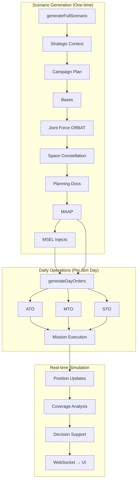

# System Architecture

## Monorepo Structure

```
overwatch/
├── client/              # React frontend (Vite)
├── server/              # Express.js backend
│   ├── prisma/
│   │   └── schema.prisma       # Database schema (PostgreSQL)
│   └── src/
│       ├── api/                 # REST route handlers
│       │   ├── scenarios.ts     # Scenario CRUD + generation trigger
│       │   ├── orders.ts        # Tasking order endpoints
│       │   ├── missions.ts      # Mission management + status
│       │   ├── simulation.ts    # Sim control (start/pause/stop)
│       │   ├── decisions.ts     # Leadership decision support
│       │   ├── advisor.ts       # AI advisor endpoints
│       │   ├── assets.ts        # Unit/asset management
│       │   ├── space-assets.ts  # Space constellation queries
│       │   ├── events.ts        # Simulation event log
│       │   └── ingest.ts        # Document ingestion endpoint
│       ├── services/            # Core business logic
│       │   ├── scenario-generator.ts   # 9-step scenario pipeline (1778 lines)
│       │   ├── simulation-engine.ts    # Real-time sim loop
│       │   ├── doc-ingest.ts           # LLM document classification + ingestion
│       │   ├── decision-advisor.ts     # AI-driven COA generation
│       │   ├── coverage-calculator.ts  # Space coverage window math
│       │   ├── space-propagator.ts     # Orbital mechanics (SGP4)
│       │   └── udl-client.ts           # Unified Data Library integration
│       ├── websocket/           # Socket.IO real-time comms
│       ├── db/                  # Prisma client singleton
│       └── config.ts            # Environment configuration
├── shared/              # Shared types between client/server
└── docs/                # This documentation
```

## Tech Stack

| Layer | Technology | Purpose |
|---|---|---|
| **Frontend** | React + Vite + TypeScript | Interactive C2 dashboard |
| **Backend** | Express.js + TypeScript | REST API + WebSocket server |
| **Database** | PostgreSQL + Prisma ORM | Relational data model |
| **AI** | OpenAI API (GPT-4o / o4-mini) | Document generation, planning |
| **Real-time** | Socket.IO | Simulation state streaming |
| **Orbital** | SGP4 propagation | Space asset position tracking |

## AI Model Selection

The system uses a tiered model selection strategy based on task complexity:

```typescript
function getModel(tier: 'flagship' | 'midRange' | 'fast'): string
```

| Tier | Model | Use Case |
|---|---|---|
| `flagship` | `o3` | Strategic documents (NDS, NMS, JSCP) — highest quality |
| `midRange` | `o4-mini` | Planning docs, MAAP, MSEL injects — balance of quality/speed |
| `fast` | `gpt-4o-mini` | Individual order parsing, real-time advisor queries |

## Data Flow



## Database Architecture

PostgreSQL with 20+ tables organized into domains:

- **Strategic**: `Scenario`, `StrategyDocument`, `PlanningDocument`, `PriorityEntry`
- **Operational**: `TaskingOrder`, `MissionPackage`, `Mission`, `Waypoint`, `TimeWindow`, `MissionTarget`
- **Force Structure**: `Unit`, `Asset`, `AssetType`, `Base`
- **Space**: `SpaceAsset`, `SpaceNeed`, `SpaceCoverageWindow`
- **Simulation**: `SimulationState`, `SimEvent`, `PositionUpdate`
- **Decision Support**: `LeadershipDecision`, `ScenarioInject`
- **Audit**: `IngestLog`

All tables cascade-delete from `Scenario` — deleting a scenario removes everything.
