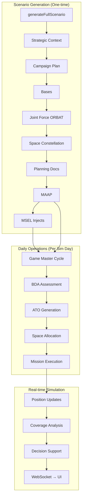

# System Architecture

## Monorepo Structure

```
overwatch/
├── client/              # React frontend (Vite)
├── server/              # Express.js backend
│   ├── prisma/
│   │   ├── schema.prisma       # Database schema (PostgreSQL)
│   │   └── seed.ts             # Database seeding
│   └── src/
│       ├── api/                 # REST route handlers
│       │   ├── scenarios.ts     # Scenario CRUD + generation + ready-made import/export
│       │   ├── orders.ts        # Tasking order endpoints
│       │   ├── missions.ts      # Mission management + status
│       │   ├── simulation.ts    # Sim control (start/pause/stop/seek/speed)
│       │   ├── decisions.ts     # Leadership decision support
│       │   ├── advisor.ts       # AI advisor: assess, COA, impact, NLQ
│       │   ├── assets.ts        # Unit/asset management
│       │   ├── space-assets.ts  # Space constellation queries + allocations
│       │   ├── events.ts        # Simulation event log
│       │   ├── ingest.ts        # Document ingestion endpoint
│       │   ├── injects.ts       # MSEL inject CRUD
│       │   ├── game-master.ts   # On-demand ATO/inject/BDA/MAAP generation
│       │   ├── knowledge-graph.ts # Knowledge graph builder API
│       │   └── timeline.ts      # Timeline / Gantt data endpoint
│       ├── services/            # Core business logic
│       │   ├── scenario-generator.ts   # 9-step scenario pipeline (1644 lines)
│       │   ├── simulation-engine.ts    # Real-time sim loop (1300 lines)
│       │   ├── doc-ingest.ts           # LLM document classification + ingestion
│       │   ├── decision-advisor.ts     # AI-driven COA generation + NLQ
│       │   ├── game-master.ts          # Game Master: read graph → generate → ingest back
│       │   ├── coverage-calculator.ts  # Space coverage window math
│       │   ├── space-propagator.ts     # Orbital mechanics (SGP4)
│       │   ├── space-allocator.ts      # Priority-weighted space resource allocation
│       │   ├── udl-client.ts           # Unified Data Library integration
│       │   ├── reference-data.ts       # INDOPACOM ORBAT + adversary reference data
│       │   ├── llm-schemas.ts          # Centralized JSON schemas for LLM outputs
│       │   ├── generation-logger.ts    # Structured LLM generation audit logging
│       │   ├── demo-doc-generator.ts   # Realistic training document generator
│       │   └── scenario-cache.ts       # In-memory scenario caching
│       ├── websocket/           # Socket.IO real-time comms
│       ├── db/                  # Prisma client singleton
│       └── config.ts            # Environment configuration
├── shared/              # Shared types between client/server
├── scenarios/           # Ready-made scenario ZIP files
└── docs/                # This documentation
```

## Tech Stack

| Layer | Technology | Purpose |
|---|---|---|
| **Frontend** | React + Vite + TypeScript | Interactive C2 dashboard (10 pages) |
| **State** | Zustand | Client-side state management + WebSocket sync |
| **Backend** | Express.js + TypeScript | REST API + WebSocket server |
| **Database** | PostgreSQL + Prisma ORM | Relational data model (22 tables) |
| **AI** | OpenAI API (o3 / o4-mini / gpt-4o-mini) | Document generation, planning, decision support |
| **Real-time** | Socket.IO | Simulation state streaming |
| **Orbital** | SGP4 propagation | Space asset position tracking |

## AI Model Selection

The system uses a tiered model selection strategy based on task complexity:

```typescript
function getModel(tier: 'flagship' | 'midRange' | 'fast'): string
```

| Tier | Model | Use Case |
|---|---|---|
| `flagship` | `o3` | Strategic documents (NDS, NMS, JSCP) — highest quality |
| `midRange` | `o4-mini` | Planning docs, MAAP, MSEL, Game Master operations |
| `fast` | `gpt-4o-mini` | Individual order parsing, real-time advisor queries, demo docs |

All calls use `reasoning_effort: 'medium'` to balance quality with speed.

## Data Flow



## Database Architecture

PostgreSQL with 22 tables organized into domains:

- **Strategic**: `Scenario`, `StrategyDocument`, `StrategyPriority`, `PlanningDocument`, `PriorityEntry`
- **Operational**: `TaskingOrder`, `MissionPackage`, `Mission`, `Waypoint`, `TimeWindow`, `MissionTarget`, `SupportRequirement`
- **Force Structure**: `Unit`, `Asset`, `AssetType`, `Base`
- **Space**: `SpaceAsset`, `SpaceNeed`, `SpaceCoverageWindow`, `SpaceAllocation`
- **Simulation**: `SimulationState`, `SimEvent`, `PositionUpdate`
- **Decision Support**: `LeadershipDecision`, `ScenarioInject`
- **Audit**: `IngestLog`, `GenerationLog`

All tables cascade-delete from `Scenario` — deleting a scenario removes everything.

## Generation Pipeline Tracking

Scenario generation is tracked in real-time via fields on the `Scenario` model:

| Field | Type | Purpose |
|---|---|---|
| `generationStatus` | `GenerationStatus` | PENDING → GENERATING → COMPLETE / FAILED |
| `generationStep` | String | Current step name (e.g. "Strategic Context") |
| `generationProgress` | Int | 0–100 percentage |
| `generationError` | Text | Error message if FAILED |

The client polls `GET /api/scenarios/:id/generation-status` for live progress updates during the 2–4 minute pipeline execution.
