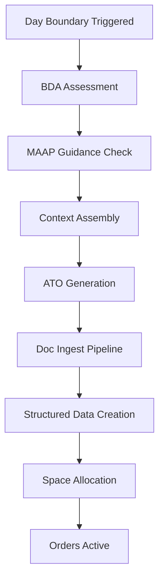

# Daily Tasking Cycle

The daily tasking cycle generates operational orders (ATO, MTO, STO) for each simulated day. It has evolved from simple order generation to a closed-loop AI pipeline driven by the Game Master service.

## Overview



## Phase 1: Context Assembly

Before generating orders, the system assembles comprehensive context:

| Context Source | Data | Purpose |
|---|---|---|
| **MAAP Guidance** | Active MAAP document | Sortie allocation, target priority |
| **OPLAN Phase** | Current phase from scenario timeline | ROE, objectives for current phase |
| **Previous Day BDA** | `assessBDA()` results | Restrike nominations, degraded targets |
| **Previous ATO** | Prior day's tasking order text | Continuity of operations |
| **ORBAT** | All units with capabilities | Available forces |
| **Space Assets** | Constellation status | Available space support |
| **Active Injects** | Unfired MSEL events | Planned friction/crises |
| **Strategic Priorities** | `StrategyPriority` chain | Top-level objectives driving operations |

## Phase 2: BDA Assessment (`assessBDA`)

The Game Master evaluates the previous day's results:

1. **Per-target assessment**: Each target receives `damagePercent`, `functionalKill` (boolean), `restrikeNeeded` (boolean), and `effect` description
2. **Restrike nominations**: Targets with insufficient damage are flagged for re-attack
3. **Priority updates**: `PriorityEntry` records are updated based on target degradation — sufficiently degraded targets drop in priority, new targets may be nominated
4. **Mission effectiveness**: Sorties fragged vs. executed vs. effective rates

## Phase 3: Order Generation

### ATO (Air Tasking Order)
**Model**: `midRange` (o4-mini)

The Game Master generates a complete ATO document:
1. Builds full scenario context via `buildScenarioContext()`
2. Generates prose ATO using the `ATO_PROMPT` template
3. Feeds generated text through `classifyAndNormalize()` (doc-ingest pipeline)
4. Pipeline creates: `TaskingOrder` → `MissionPackage[]` → `Mission[]` with `Waypoint[]`, `TimeWindow[]`, `MissionTarget[]`, `SupportRequirement[]`, `SpaceNeed[]`

### MTO (Maritime Tasking Order)
Generated as part of the day orders with maritime-specific mission types (ASW, MIW, SUW, naval ISR).

### STO (Space Tasking Order)
Generated with space-specific tasking (satellite repositioning, coverage windows, link scheduling).

## Phase 4: Space Allocation

After orders are generated, the Space Allocator resolves resource contention:

1. Gather all `SpaceNeed` records for the ATO day
2. Match needs against available `SpaceCoverageWindow` entries
3. Detect contention groups (multiple needs competing for same capability/time/area)
4. Resolve by priority rank (traced from `PriorityEntry` → `StrategyPriority`)
5. Create `SpaceAllocation` records with status: FULFILLED, DEGRADED, CONTENTION, or DENIED

## Phase 5: Orders Active

Generated orders become active in the simulation:
- Missions enter `PLANNED` status
- Simulation engine begins progression through the mission state machine
- Positions are interpolated along waypoint tracks
- Space assets provide coverage per allocated windows

## Closed-Loop Pipeline

The key innovation is the **read → generate → ingest back** loop:

```
DB (Knowledge Graph) → Game Master → Prose Document → Doc Ingest → Structured Data → DB
```

This means:
- The Game Master reads the current state of the world from the database
- Generates human-readable operational documents
- Those documents are processed by the same ingestion pipeline used for external documents
- The result is properly structured data back in the database

This approach ensures consistency between AI-generated and human-authored orders — both flow through the same normalization pipeline.

## Auto-Populated Space Needs

Each generated mission automatically includes space requirements:

| Mission Type | Typical Space Needs |
|---|---|
| **Strike (CAS, AI, BAI)** | GPS_MILITARY, SATCOM_PROTECTED, ISR_SPACE |
| **Air Defense (DCA, OCA)** | OPIR, LINK16, SATCOM_WIDEBAND |
| **ISR** | SATCOM_WIDEBAND, SDA, DATALINK |
| **Maritime (ASW, MIW)** | SATCOM_TACTICAL, WEATHER, GPS |
| **SEAD** | SIGINT_SPACE, EW_SPACE, GPS_MILITARY |
| **Space Ops** | SDA, SSA, LAUNCH_DETECT, CYBER_SPACE |

Space needs are generated with:
- `missionCriticality` (CRITICAL → ROUTINE)
- `fallbackCapability` for graceful degradation
- `riskIfDenied` — AI-generated risk assessment text
- `priorityEntryId` — traced back to JIPTL/strategy priority
