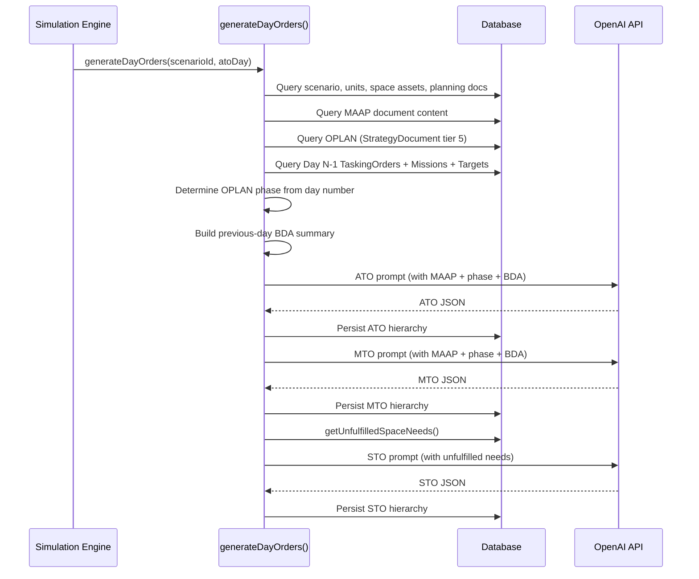

# Daily Tasking Cycle

## Overview

The daily tasking cycle generates Air Tasking Orders (ATO), Maritime Tasking Orders (MTO), and Space Tasking Orders (STO) for each day of the scenario. Starting with Phase C, each day's orders are **context-aware** — they adapt to the current campaign phase, reference MAAP sortie guidance, and react to previous-day mission outcomes.

## Execution Flow



## Context Assembly

### MAAP Guidance

The MAAP (Master Air Attack Plan) document is queried from `PlanningDocument` where `docType = 'MAAP'`. The first 2000 characters are injected into ATO/MTO prompts to control sortie allocation per JIPTL priority.

### OPLAN Phase Determination

Campaign phase is determined deterministically from the ATO day number:

| Day Range | Phase | Character |
|---|---|---|
| Day 1 | Phase 0: Shape | Pre-hostility posturing, ISR emphasis, deterrence |
| Days 2–3 | Phase 1: Deter | Show of force, forward deployment, SEAD/DCA establishment |
| Days 4–5 | Phase 2: Seize Initiative | Opening strikes, IADS suppression, air superiority |
| Days 6–8 | Phase 3: Dominate | Sustained operations, deep strike, maritime interdiction |
| Days 9+ | Phase 4: Stabilize | Exploitation, dynamic targeting, reduced tempo |

### Previous-Day Mission Summary

For Day 2+, the system queries all `TaskingOrder` records from the previous day with their full mission hierarchy:

```
TaskingOrder (Day N-1)
  → MissionPackage[]
    → Mission[]
      → MissionTarget[]
```

Each mission is summarized as:
```
VIPER 11 (OCA, F-35Ax4) — Status: PLANNED — Targets: Adversary SAM Battery Alpha
```

Maximum 15 entries are included to stay within token limits.

## Order Generation

### ATO (Air Tasking Order)

**Prompt template**: `ATO_PROMPT`

Generates 3–6 mission packages covering:
- DCA (Defensive Counter Air)
- OCA (Offensive Counter Air) / Strike
- SEAD (Suppression of Enemy Air Defenses)
- CAS (Close Air Support)
- AI (Air Interdiction)
- ISR (Intelligence, Surveillance, Reconnaissance)
- TANKER (Aerial Refueling)
- C2 (Command and Control / AWACS)

Each mission includes full waypoint routing with lat/lon, TOT windows, target assignments, support requirements, and space capability needs.

### MTO (Maritime Tasking Order)

**Prompt template**: `MTO_PROMPT`

Generates 2–4 mission packages covering:
- ASW patrols
- Surface warfare
- Mine countermeasures
- Carrier strike group operations
- Escort/sea lane security
- Maritime ISR

### STO (Space Tasking Order)

**Prompt template**: `STO_PROMPT`

Generated **after** ATO and MTO to address their unfulfilled space needs. Covers:
- GPS constellation task allocation
- SATCOM bandwidth prioritization (AEHF, WGS, MUOS)
- OPIR/missile warning coverage
- Space ISR tasking
- Maintenance windows

## Auto-Populated Space Needs

After each order is generated, the system deterministically creates additional `SpaceNeed` records based on platform communications systems:

| Platform Comms | Generated SpaceNeed |
|---|---|
| MUOS | `SATCOM_TACTICAL` |
| WGS | `SATCOM_WIDEBAND` |
| AEHF | `SATCOM_PROTECTED` |
| GPS (any type) | `GPS` |
| LINK16 | `LINK16` |

This ensures space dependency tracking reflects actual platform capabilities, not just what the LLM includes in its response.

## MSEL Injects

`ScenarioInject` records are pre-generated during scenario creation (Step 9 of the pipeline). During simulation, injects fire at their scheduled `triggerDay` + `triggerHour`, creating operational friction:

| Type | Examples |
|---|---|
| FRICTION | Equipment failure, tanker divert, weather delay |
| INTEL | SIGINT intercept, adversary repositioning |
| CRISIS | Civilian incident, ROE change, escalation |
| SPACE | GPS jamming, SATCOM degradation, debris event |

Injects influence subsequent day planning through the previous-day context chain — if a GPS jamming inject fires on Day 3, Day 4's ATO should reference the degraded GPS environment.
