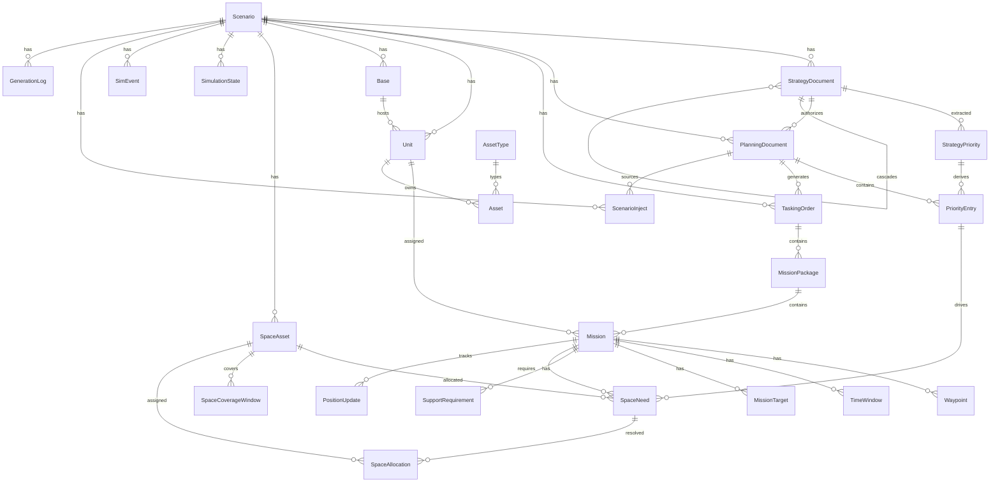

# Data Model Reference

Complete reference for the Overwatch Prisma schema. All models cascade-delete from `Scenario`.

## Entity Relationship Overview

## Enums

### `OrderType`
`ATO` | `MTO` | `STO` | `OPORD` | `EXORD` | `FRAGORD` | `ACO` | `SPINS`

### `Domain`
`AIR` | `MARITIME` | `SPACE` | `LAND`

### `MissionStatus`
`PLANNED` → `BRIEFED` → `LAUNCHED` → `AIRBORNE` → `ON_STATION` → `ENGAGED` → `EGRESSING` → `RTB` → `RECOVERED`
Branch states: `CANCELLED` | `DIVERTED` | `DELAYED`

### `WaypointType`
`DEP` | `IP` | `CP` | `TGT` | `EGR` | `REC` | `ORBIT` | `REFUEL` | `CAP` | `PATROL`

### `TimeWindowType`
`TOT` | `ONSTA` | `OFFSTA` | `REFUEL` | `COVERAGE` | `SUPPRESS` | `TRANSIT`

### `SupportType`
`TANKER` | `SEAD` | `ISR` | `EW` | `ESCORT` | `CAP`

### `SpaceCapabilityType`
`GPS` | `GPS_MILITARY` | `SATCOM` | `SATCOM_PROTECTED` | `SATCOM_WIDEBAND` | `SATCOM_TACTICAL` | `OPIR` | `ISR_SPACE` | `EW_SPACE` | `WEATHER` | `PNT` | `LINK16` | `SIGINT_SPACE` | `SDA` | `LAUNCH_DETECT` | `CYBER_SPACE` | `DATALINK` | `SSA`

### `MissionCriticality`
| Value | Meaning |
|---|---|
| `CRITICAL` | Loss = mission failure, no workaround |
| `ESSENTIAL` | Loss = degraded mission, partial workaround |
| `ENHANCING` | Loss = reduced effectiveness, full workaround |
| `ROUTINE` | Loss = inconvenience, easily substituted |

### `AllocationStatus`
| Value | Meaning |
|---|---|
| `FULFILLED` | Need met by assigned asset |
| `DEGRADED` | Fallback capability assigned, reduced effectiveness |
| `CONTENTION` | Multiple needs competing, awaiting resolution |
| `DENIED` | No asset available, mission accepts risk |
| `PENDING` | Not yet evaluated |

### `GenerationStatus`
`PENDING` | `GENERATING` | `COMPLETE` | `FAILED`

### `Affiliation`
`FRIENDLY` | `HOSTILE` | `NEUTRAL` | `UNKNOWN`

### `Classification`
`UNCLASSIFIED` | `CUI` | `CONFIDENTIAL` | `SECRET` | `TOP_SECRET`

---

## Core Models

### `Scenario`

The root entity. Everything cascades from here.

| Field | Type | Description |
|---|---|---|
| `id` | UUID | Primary key |
| `name` | String | Scenario name |
| `description` | String | Scenario description |
| `theater` | String | Theater of operations (e.g. "Western Pacific") |
| `adversary` | String | Primary adversary |
| `startDate` | DateTime | Scenario start |
| `endDate` | DateTime | Scenario end |
| `classification` | Classification | Security level (default: UNCLASSIFIED) |
| `compressionRatio` | Float | Sim speed (720 = 1 real min = 12 sim hrs) |
| `generationStatus` | GenerationStatus | Pipeline status tracking |
| `generationStep` | String? | Current pipeline step name |
| `generationProgress` | Int | 0–100 completion percentage |
| `generationError` | Text? | Error message if FAILED |

### `StrategyDocument`

Strategic/doctrinal documents in the doctrine cascade (NDS → NMS → JSCP → CONPLAN → OPLAN).

| Field | Type | Description |
|---|---|---|
| `id` | UUID | Primary key |
| `scenarioId` | FK → Scenario | Parent scenario |
| `title` | String | Document title |
| `docType` | String | NDS, NMS, JSCP, CONPLAN, OPLAN, CAMPAIGN_PLAN, JFC_GUIDANCE, COMPONENT_GUIDANCE |
| `content` | Text | Full document text |
| `authorityLevel` | String | Issuing authority |
| `tier` | Int | Hierarchy tier (1=NDS … 5=OPLAN) |
| `parentDocId` | FK → self | Parent in doctrine cascade |
| `sourceFormat` | String? | MEMORANDUM, PLAIN_TEXT, etc. |
| `confidence` | Float? | LLM classification confidence 0.0–1.0 |
| `reviewFlags` | JSON? | Items needing human review |
| `ingestedAt` | DateTime? | When ingested (null if generated) |

### `StrategyPriority`

AI-extracted strategic priorities from strategy documents (NDS objectives, NMS goals, etc.).

| Field | Type | Description |
|---|---|---|
| `id` | UUID | Primary key |
| `strategyDocId` | FK → StrategyDocument | Source document |
| `rank` | Int | Priority rank within document |
| `objective` | String | Short objective label |
| `description` | Text | Full objective text |
| `effect` | String? | Desired strategic effect |
| `confidence` | Float? | AI extraction confidence |

Downstream: links to `PriorityEntry[]` for traceability through the planning chain.

### `PlanningDocument`

Operational planning documents (JIPTL, JPEL, MAAP, ACO, SPINS).

| Field | Type | Description |
|---|---|---|
| `id` | UUID | Primary key |
| `scenarioId` | FK → Scenario | Parent scenario |
| `strategyDocId` | FK? → StrategyDocument | Authority document |
| `title` | String | Document title |
| `docType` | String | JIPTL, JPEL, COMPONENT_PRIORITY, SPINS, ACO, MAAP |
| `content` | Text | Full document text |
| `docTier` | Int | Hierarchy (1=CONPLAN … 5=ACO/SPINS) |
| `sourceFormat` | String? | Ingestion source format |
| `confidence` | Float? | Classification confidence |
| `reviewFlags` | JSON? | Items needing review |

### `PriorityEntry`

Individual priority targets extracted from planning documents.

| Field | Type | Description |
|---|---|---|
| `id` | UUID | Primary key |
| `planningDocId` | FK → PlanningDocument | Source planning doc |
| `strategyPriorityId` | FK? → StrategyPriority | Traced strategy origin |
| `rank` | Int | Priority rank |
| `targetId` | String? | Target identifier |
| `effect` | String | Desired effect |
| `description` | String | Target description |
| `justification` | Text | Priority justification |

Downstream: links to `SpaceNeed[]` for space resource traceability.

### `TaskingOrder`

ATO, MTO, STO, and other operational orders.

| Field | Type | Description |
|---|---|---|
| `id` | UUID | Primary key |
| `scenarioId` | FK → Scenario | Parent scenario |
| `planningDocId` | FK? → PlanningDocument | Authority planning doc |
| `orderType` | OrderType | ATO, MTO, STO, OPORD, etc. |
| `orderId` | String | Order identifier (e.g. "ATO-2026-025A") |
| `atoDayNumber` | Int? | ATO day assignment |
| `rawText` | Text? | Original order text |
| `rawFormat` | String? | USMTF, OTH_GOLD, MTF_XML, PLAIN_TEXT |
| `sourceFormat` | String? | Ingestion source format |
| `confidence` | Float? | Classification confidence |

### `MissionPackage`

Groups of missions within a tasking order.

| Field | Type | Description |
|---|---|---|
| `id` | UUID | Primary key |
| `taskingOrderId` | FK → TaskingOrder | Parent order |
| `packageId` | String | Package ID (e.g. "PKGA01") |
| `priorityRank` | Int | Priority within the order |
| `missionType` | String | Package mission type |
| `effectDesired` | String | Desired operational effect |

### `Mission`

Individual missions assigned to a package.

| Field | Type | Description |
|---|---|---|
| `id` | UUID | Primary key |
| `packageId` | FK → MissionPackage | Parent package |
| `missionId` | String | ID (e.g. "MSN4001") |
| `callsign` | String? | Callsign (e.g. "VIPER 11") |
| `domain` | Domain | AIR, MARITIME, SPACE, LAND |
| `unitId` | FK? → Unit | Assigned unit |
| `platformType` | String | Platform (e.g. "F-35A") |
| `platformCount` | Int | Number of platforms |
| `missionType` | String | CAS, DCA, SEAD, ASW, etc. |
| `status` | MissionStatus | Current status |
| `affiliation` | Affiliation | FRIENDLY / HOSTILE |

### `Waypoint`, `TimeWindow`, `MissionTarget`, `SupportRequirement`

Mission sub-entities:

- **Waypoint**: Sequence of lat/lon/alt points (DEP, IP, TGT, REC, etc.)
- **TimeWindow**: Time-on-target, on/off station, refuel, coverage, suppress windows
- **MissionTarget**: Target with BE number, coordinates, desired effect, priority rank, collateral concern
- **SupportRequirement**: Tanker, SEAD, ISR, EW, escort, CAP dependencies

### `Unit`, `Asset`, `AssetType`, `Base`

Force structure:

- **Unit**: Military units with designation, service, domain, base location, affiliation
- **AssetType**: Platform types with domain, MIL symbol code, comms systems, GPS type, data links
- **Asset**: Individual assets (tail numbers) assigned to units with operational status
- **Base**: Installations (airbases, naval bases) with ICAO code, coordinates, country

### `SpaceAsset`

Space constellation members.

| Field | Type | Description |
|---|---|---|
| `id` | UUID | Primary key |
| `scenarioId` | FK → Scenario | Parent scenario |
| `name` | String | Satellite name |
| `constellation` | String | Constellation (GPS, WGS, AEHF, etc.) |
| `affiliation` | Affiliation | FRIENDLY / HOSTILE |
| `noradId` | String? | NORAD catalog number |
| `tleLine1/2` | String? | Two-line element set for SGP4 |
| `capabilities` | SpaceCapabilityType[] | Provided capabilities |
| `status` | String | OPERATIONAL / MAINTENANCE / DEGRADED / LOST |
| `operator` | String? | Operating organization (USSF, PLASSF, etc.) |
| `coverageRegion` | String? | GLOBAL, WESTPAC, CONUS, etc. |
| `bandwidthProvided` | String[] | Comm bands (EHF, SHF, Ka, etc.) |
| `inclination` | Float? | Orbital inclination |
| `eccentricity` | Float? | Orbital eccentricity |
| `periodMin` | Float? | Orbital period in minutes |
| `apogeeKm` / `perigeeKm` | Float? | Orbit altitude bounds |

### `SpaceNeed`

Space capability requirements for missions.

| Field | Type | Description |
|---|---|---|
| `id` | UUID | Primary key |
| `missionId` | FK → Mission | Requesting mission |
| `spaceAssetId` | FK? → SpaceAsset | Preferred asset |
| `capabilityType` | SpaceCapabilityType | Required capability |
| `priority` | Int | Need priority |
| `role` | String | PRIMARY, BACKUP, CONTINGENCY |
| `commsBand` | String? | Specific band (EHF, SHF, UHF, etc.) |
| `systemName` | String? | Specific system (AEHF, WGS, MUOS) |
| `startTime` / `endTime` | DateTime | Coverage window required |
| `coverageLat/Lon` | Float? | Required coverage center |
| `coverageRadiusKm` | Float? | Coverage radius |
| `priorityEntryId` | FK? → PriorityEntry | Traced priority origin |
| `fallbackCapability` | SpaceCapabilityType? | Substitute if primary denied |
| `missionCriticality` | MissionCriticality | CRITICAL → ROUTINE |
| `riskIfDenied` | String? | AI-generated risk assessment |

### `SpaceAllocation`

Space resource allocation decisions.

| Field | Type | Description |
|---|---|---|
| `id` | UUID | Primary key |
| `spaceNeedId` | FK → SpaceNeed | Resolved need |
| `spaceAssetId` | FK? → SpaceAsset | Assigned asset |
| `status` | AllocationStatus | FULFILLED / DEGRADED / CONTENTION / DENIED / PENDING |
| `allocatedCapability` | SpaceCapabilityType? | May differ from requested if degraded |
| `rationale` | Text? | AI-generated allocation reasoning |
| `riskLevel` | String? | LOW / MODERATE / HIGH / CRITICAL |
| `contentionGroup` | String? | Groups competing needs |

### `SpaceCoverageWindow`

Pre-computed satellite coverage passes.

| Field | Type | Description |
|---|---|---|
| `id` | UUID | Primary key |
| `spaceAssetId` | FK → SpaceAsset | Satellite |
| `startTime` / `endTime` | DateTime | Coverage window |
| `maxElevation` | Float | Peak elevation angle |
| `centerLat/Lon` | Float | Coverage center |
| `swathWidthKm` | Float | Coverage swath |
| `capabilityType` | SpaceCapabilityType | Capability during window |

### `SimulationState`

Simulation runtime state.

| Field | Type | Description |
|---|---|---|
| `status` | String | IDLE / RUNNING / PAUSED / STOPPED |
| `simTime` | DateTime | Current simulation time |
| `compressionRatio` | Float | Current time compression |
| `currentAtoDay` | Int | Active ATO day number |

### `PositionUpdate`

Time-series mission position track.

| Field | Type | Description |
|---|---|---|
| `missionId` | FK → Mission | Tracked mission |
| `callsign` | String? | Mission callsign |
| `domain` | Domain | Operating domain |
| `timestamp` | DateTime | Sim time of update |
| `latitude/longitude` | Float | Position |
| `altitude_ft` | Float? | Altitude |
| `heading` | Float? | Heading in degrees |
| `speed_kts` | Float? | Speed in knots |
| `status` | MissionStatus | Status at time of update |
| `fuelState` | String? | Fuel state indicator |

### `ScenarioInject`

MSEL (Master Scenario Event List) injects — doctrine-compliant per CJCSM 3500.03F.

| Field | Type | Description |
|---|---|---|
| `id` | UUID | Primary key |
| `scenarioId` | FK → Scenario | Parent scenario |
| `triggerDay` | Int | ATO day number |
| `triggerHour` | Int | Hour within day (0–23) |
| `injectType` | String | FRICTION, INTEL, CRISIS, SPACE or INFORMATION, ACTION, DECISION_POINT, CONTINGENCY |
| `title` | String | Short title |
| `description` | Text | Full description |
| `impact` | String | Operational impact / controller guidance |
| `serialNumber` | String? | MSEL serial (e.g. "001") |
| `mselLevel` | String? | STRAT_NAT, STRAT_THEATER, OPERATIONAL, TACTICAL |
| `injectMode` | String? | RADIO, EMAIL, VERBAL, MSG_TRAFFIC, HANDOUT, CHAT |
| `fromEntity` | String? | Originator (e.g. "EXCON SimCell") |
| `toEntity` | String? | Recipient (e.g. "JFACC") |
| `expectedResponse` | Text? | What training audience should do |
| `objectiveTested` | String? | Linked exercise objective / UJTL task |
| `planningDocId` | FK? → PlanningDocument | Source MSEL document |
| `fired` | Boolean | Whether inject has been triggered |
| `firedAt` | DateTime? | When fired in sim-time |

### `LeadershipDecision`

Decision support records.

| Field | Type | Description |
|---|---|---|
| `scenarioId` | String | Scenario ID |
| `decisionType` | String | ASSET_REALLOCATION, PRIORITY_SHIFT, MAINTENANCE_SCHEDULE, CONTINGENCY |
| `description` | Text | Decision description |
| `affectedAssetIds` | String[] | Impacted asset IDs |
| `affectedMissionIds` | String[] | Impacted mission IDs |
| `rationale` | Text | Decision rationale |
| `status` | String | PROPOSED → APPROVED → EXECUTED |

### `IngestLog`

Document ingestion audit trail.

| Field | Type | Description |
|---|---|---|
| `inputHash` | String | SHA-256 of raw text (dedup) |
| `hierarchyLevel` | String | STRATEGY, PLANNING, ORDER |
| `documentType` | String | NMS, JIPTL, ATO, FRAGORD, etc. |
| `sourceFormat` | String | USMTF, OTH_GOLD, MEMORANDUM, etc. |
| `confidence` | Float | Classification confidence |
| `createdRecordId` | String? | ID of created entity |
| `extractedCounts` | JSON? | { missions, waypoints, targets, ... } |
| `reviewFlagCount` | Int | Number of review flags |
| `parseTimeMs` | Int | Processing duration |

### `GenerationLog`

LLM generation audit trail for the scenario pipeline.

| Field | Type | Description |
|---|---|---|
| `id` | UUID | Primary key |
| `scenarioId` | FK → Scenario | Parent scenario |
| `step` | String | Pipeline step (e.g. "Strategic Context") |
| `artifact` | String | Generated artifact (e.g. "NDS", "CONPLAN") |
| `status` | String | success / placeholder / error / retry |
| `model` | String | LLM model used |
| `promptTokens` | Int? | Input tokens |
| `outputTokens` | Int? | Output tokens |
| `outputLength` | Int | Character count of response |
| `rawOutput` | Text? | Full LLM response (debug) |
| `errorMessage` | Text? | Error detail |
| `retryCount` | Int | Number of retries |
| `durationMs` | Int | Wall-clock time for call |

### `SimEvent`

Simulation events (destructive events, state changes).

| Field | Type | Description |
|---|---|---|
| `scenarioId` | FK → Scenario | Parent scenario |
| `simTime` | DateTime | Event time in sim-time |
| `eventType` | String | SATELLITE_DESTROYED, SATELLITE_JAMMED, UNIT_DESTROYED, COMMS_DEGRADED |
| `targetId` | String | Affected entity ID |
| `targetType` | String | "SpaceAsset", "Unit" |
| `description` | String | Event description |
| `effectsJson` | JSON? | Downstream effects (lost coverage, impacted missions) |
