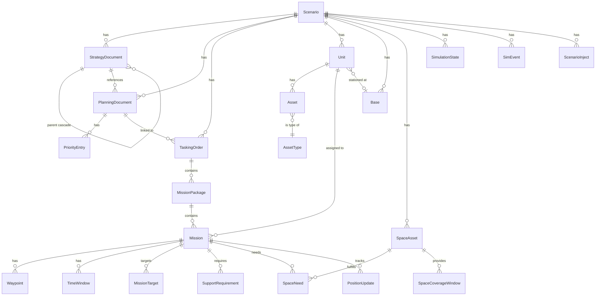

# Data Model

Complete reference for the Overwatch Prisma schema. PostgreSQL database with cascade-delete semantics — deleting a `Scenario` removes all child records.

## Entity Relationship Diagram

## Enums

### OrderType
`ATO` | `MTO` | `STO` | `OPORD` | `EXORD` | `FRAGORD` | `ACO` | `SPINS`

### Domain
`AIR` | `MARITIME` | `SPACE` | `LAND`

### MissionStatus
`PLANNED` → `BRIEFED` → `LAUNCHED` → `AIRBORNE` → `ON_STATION` → `ENGAGED` → `EGRESSING` → `RTB` → `RECOVERED`  
Also: `CANCELLED` | `DIVERTED` | `DELAYED`

### WaypointType
`DEP` | `IP` | `CP` | `TGT` | `EGR` | `REC` | `ORBIT` | `REFUEL` | `CAP` | `PATROL`

### TimeWindowType
`TOT` | `ONSTA` | `OFFSTA` | `REFUEL` | `COVERAGE` | `SUPPRESS` | `TRANSIT`

### SupportType
`TANKER` | `SEAD` | `ISR` | `EW` | `ESCORT` | `CAP`

### SpaceCapabilityType
`GPS` | `SATCOM` | `SATCOM_PROTECTED` | `SATCOM_WIDEBAND` | `SATCOM_TACTICAL` | `OPIR` | `ISR_SPACE` | `EW_SPACE` | `WEATHER` | `PNT` | `LINK16`

### Affiliation
`FRIENDLY` | `HOSTILE` | `NEUTRAL` | `UNKNOWN`

### Classification
`UNCLASSIFIED` | `CUI` | `CONFIDENTIAL` | `SECRET` | `TOP_SECRET`

---

## Core Models

### Scenario
Root aggregate. All other entities cascade-delete from here.

| Field | Type | Description |
|---|---|---|
| id | UUID | Primary key |
| name | String | Display name |
| theater | String | e.g. "INDOPACOM — Western Pacific" |
| adversary | String | e.g. "PRC" |
| startDate / endDate | DateTime | Scenario timeline |
| classification | Classification | Default: UNCLASSIFIED |

### StrategyDocument
Strategic planning documents forming the doctrine cascade.

| Field | Type | Description |
|---|---|---|
| docType | String | NDS, NMS, JSCP, CONPLAN, OPLAN |
| tier | Int | 1=NDS, 2=NMS, 3=JSCP, 4=CONPLAN, 5=OPLAN |
| content | Text | Full document text |
| parentDocId | UUID? | Self-referential cascade |
| confidence | Float? | LLM classification confidence |

### PlanningDocument
Operational planning documents derived from strategy.

| Field | Type | Description |
|---|---|---|
| docType | String | JIPTL, JPEL, SPINS, ACO, MAAP |
| docTier | Int | 1–5 hierarchy level |
| content | Text | Full document text |
| strategyDocId | UUID? | Link to parent strategy doc |

### PriorityEntry
Ranked target priorities extracted from JIPTL.

| Field | Type | Description |
|---|---|---|
| rank | Int | Priority rank (1 = highest) |
| effect | String | Desired effect (DESTROY, NEUTRALIZE, etc.) |
| justification | Text | Operational justification |

---

## Operational Models

### TaskingOrder
Generated per domain per day.

| Field | Type | Description |
|---|---|---|
| orderType | OrderType | ATO, MTO, STO |
| orderId | String | e.g. "ATO-2026-025A" |
| atoDayNumber | Int? | Day within scenario |
| planningDocId | UUID? | Linked JIPTL |
| rawText | Text? | Original LLM output |

### MissionPackage
Groups related missions (e.g. OCA strike package).

| Field | Type | Description |
|---|---|---|
| packageId | String | e.g. "PKGA01" |
| priorityRank | Int | Package priority |
| missionType | String | Package-level type |
| effectDesired | String | Desired operational effect |

### Mission
Individual mission within a package.

| Field | Type | Description |
|---|---|---|
| missionId | String | e.g. "MSN4001" |
| callsign | String? | e.g. "VIPER 11" |
| domain | Domain | AIR, MARITIME, SPACE |
| platformType | String | e.g. "F-35A" |
| platformCount | Int | Number of platforms |
| missionType | String | OCA, DCA, SEAD, ASW, etc. |
| status | MissionStatus | Default: PLANNED |

### Waypoint
Lat/lon routing for missions.

| Field | Type | Description |
|---|---|---|
| waypointType | WaypointType | DEP, IP, TGT, EGR, etc. |
| sequence | Int | Order within route |
| latitude / longitude | Float | WGS-84 coordinates |
| altitude_ft | Float? | Flight level |
| name | String? | e.g. "KADENA AB", "OBJ ALPHA" |

### MissionTarget
Target assignments per mission.

| Field | Type | Description |
|---|---|---|
| beNumber | String? | Basic Encyclopedia number |
| targetName | String | Target description |
| targetCategory | String? | AIR_DEFENSE, C2, LOGISTICS, etc. |
| desiredEffect | String | DESTROY, NEUTRALIZE, SUPPRESS |
| latitude / longitude | Float | Target coordinates |

---

## Force Structure Models

### Unit
Military organizations (squadrons, ships, battalions).

| Field | Type | Description |
|---|---|---|
| unitName | String | "388th Fighter Wing" |
| unitDesignation | String | "388 FW" |
| serviceBranch | String | USAF, USN, USMC |
| domain | Domain | AIR, MARITIME |
| affiliation | Affiliation | FRIENDLY, HOSTILE |
| baseLocation | String | Base name |
| baseLat / baseLon | Float | Base coordinates |

### AssetType
Platform catalog with communications capabilities.

| Field | Type | Description |
|---|---|---|
| name | String (unique) | "F-35A", "DDG-51" |
| domain | Domain | Platform domain |
| commsSystems | Json? | Array of {band, system, role} |
| gpsType | String? | M-CODE, SAASM, STANDARD |
| dataLinks | String[] | ["LINK16", "MADL"] |

### Base
Theater installations.

| Field | Type | Description |
|---|---|---|
| name | String | "Kadena AB" |
| baseType | String | AIRBASE, NAVAL_BASE, JOINT_BASE |
| icaoCode | String? | Aviation identifier |
| latitude / longitude | Float | Installation coordinates |

---

## Space Domain Models

### SpaceAsset
Satellite constellation members.

| Field | Type | Description |
|---|---|---|
| constellation | String | GPS_III, WGS, AEHF, MUOS, SBIRS |
| capabilities | SpaceCapabilityType[] | Array of capability enums |
| orbital params | Float | inclination, eccentricity, period, apogee, perigee |
| noradId | String? | NORAD catalog number |
| tleLine1/2 | String? | TLE data for propagation |

### SpaceNeed
Mission-level space dependency tracking.

| Field | Type | Description |
|---|---|---|
| capabilityType | SpaceCapabilityType | GPS, SATCOM_PROTECTED, etc. |
| priority | Int | Need priority |
| role | String | PRIMARY, BACKUP, CONTINGENCY |
| commsBand | String? | EHF, SHF, UHF |
| systemName | String? | AEHF, WGS, MUOS |
| fulfilled | Boolean | Whether need is satisfied |
| coverageLat/Lon | Float? | Required coverage area |

### SpaceCoverageWindow
Computed satellite coverage periods.

| Field | Type | Description |
|---|---|---|
| startTime / endTime | DateTime | Coverage period |
| maxElevation | Float | Peak elevation angle |
| swathWidthKm | Float | Ground coverage width |

---

## Simulation & Decision Models

### SimulationState
Singleton per scenario tracking sim progress.

| Field | Type | Description |
|---|---|---|
| status | String | IDLE, RUNNING, PAUSED, STOPPED |
| simTime | DateTime | Current simulation time |
| compressionRatio | Float | Default 720 (1 min = 12 hrs) |
| currentAtoDay | Int | Current ATO day |

### SimEvent
Discrete simulation events.

| Field | Type | Description |
|---|---|---|
| eventType | String | SATELLITE_DESTROYED, UNIT_DESTROYED, COMMS_DEGRADED |
| targetId | String | Affected entity ID |
| targetType | String | "SpaceAsset", "Unit" |
| effectsJson | Json? | Downstream effects |

### ScenarioInject
MSEL friction events.

| Field | Type | Description |
|---|---|---|
| triggerDay | Int | ATO day to fire |
| triggerHour | Int | Hour within day (0–23) |
| injectType | String | FRICTION, INTEL, CRISIS, SPACE |
| title | String | Short inject name |
| description | Text | Full inject narrative |
| impact | String | Operational impact |
| fired | Boolean | Whether inject has been triggered |

### LeadershipDecision
AI-recommended decisions awaiting approval.

| Field | Type | Description |
|---|---|---|
| decisionType | String | ASSET_REALLOCATION, PRIORITY_SHIFT, etc. |
| status | String | PROPOSED, APPROVED, EXECUTED |
| rationale | Text | AI-generated justification |
| affectedAssetIds | String[] | Impacted assets |

### IngestLog
Audit trail for document processing.

| Field | Type | Description |
|---|---|---|
| inputHash | String | SHA-256 for deduplication |
| hierarchyLevel | String | STRATEGY, PLANNING, ORDER |
| confidence | Float | Classification confidence |
| parseTimeMs | Int | Processing duration |
| extractedCounts | Json? | { missions: 4, waypoints: 12, ... } |
