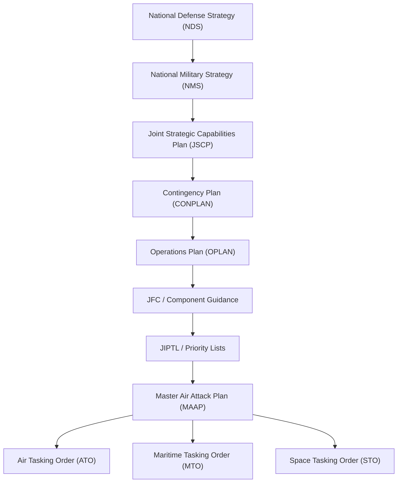
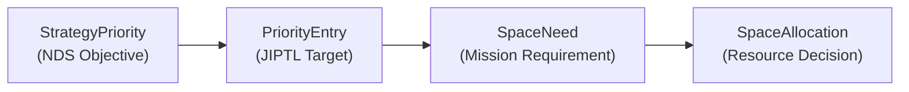

# Doctrine Cascade

Overwatch generates strategic documents hierarchically, mirroring the real-world doctrine cascade from national strategy down to operational plans.

## Cascade Hierarchy



## Context Passing

Each tier receives the full content of its parent as input context:

| Tier | Document | Context Input | Model |
|---|---|---|---|
| 1 | NDS | Scenario description only | `flagship` (o3) |
| 2 | NMS | NDS content | `flagship` |
| 3 | JSCP | NDS + NMS content | `flagship` |
| 4 | CONPLAN | NDS + NMS + JSCP content | `flagship` |
| 5 | OPLAN | NDS + NMS + JSCP + CONPLAN content | `flagship` |
| 6 | JFC/Component Guidance | Full strategic context | `midRange` |
| 7 | JIPTL / Priority Lists | OPLAN + strategic priorities | `midRange` |
| 8 | MAAP | JIPTL + OPLAN + ORBAT | `midRange` |
| 9 | ATO/MTO/STO | MAAP + BDA + ORBAT + space assets | `midRange` |

## Priority Traceability Chain

A distinguishing feature of Overwatch is **end-to-end priority traceability** — from national objectives to individual space resource allocations:



### `StrategyPriority`
AI-extracted strategic priorities from each strategy document. Each has:
- `rank` — Priority rank within the document
- `objective` — Short objective label
- `description` — Full objective text
- `effect` — Desired strategic effect
- `confidence` — AI extraction confidence

### `PriorityEntry`
Operational priorities in planning documents (JIPTL targets). Each references:
- `strategyPriorityId` — Which strategy priority it derives from
- `rank`, `targetId`, `effect`, `justification`

### `SpaceNeed`
Space capability requirements for missions. Each references:
- `priorityEntryId` — Which JIPTL/planning priority drives this need
- `missionCriticality` — How critical the space support is
- `riskIfDenied` — AI-assessed risk if space support unavailable

### `SpaceAllocation`
Resource allocation decisions. Resolution priority is directly informed by the traced priority chain.

## Generation vs. Ingestion

**Generation** and **ingestion** are decoupled processes:

| Process | Direction | Purpose |
|---|---|---|
| **Generation** | AI → Database | Create documents from scenario parameters |
| **Ingestion** | Document → Database | Parse human-authored or external documents |

Both produce the same database structures. The Game Master demonstrates the full loop: it **generates** prose documents, then feeds them through the **ingestion** pipeline to create structured data. This ensures consistency between AI-generated and human-authored content.

## Self-Referential Cascade

Strategy documents form a self-referential tree via `parentDocId`:

```
NDS (tier 1, parentDocId: null)
  └── NMS (tier 2, parentDocId: NDS.id)
       └── JSCP (tier 3, parentDocId: NMS.id)
            └── CONPLAN (tier 4, parentDocId: JSCP.id)
                 └── OPLAN (tier 5, parentDocId: CONPLAN.id)
```

This allows the UI to render the full doctrine tree and trace any operational decision back to its strategic origin.
