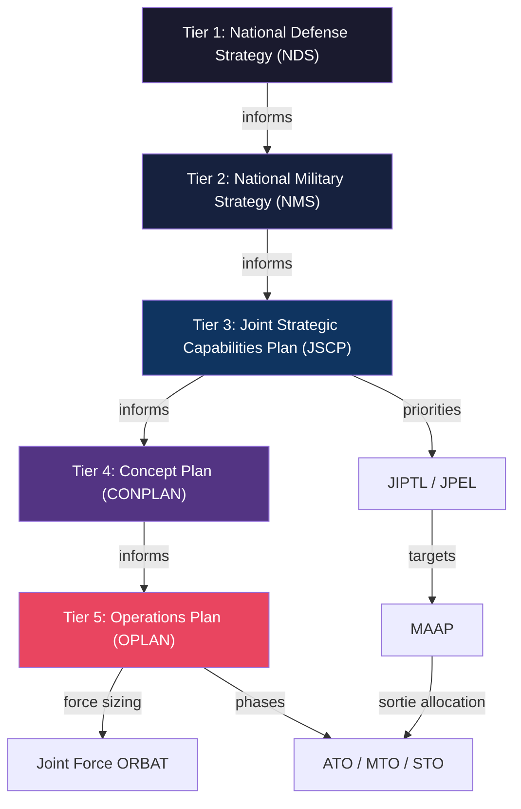

# Doctrine Cascade

## Overview

Overwatch generates a hierarchical chain of strategic documents that mirrors the real U.S. military planning process. Each document tier is generated by an LLM that receives the **full text of its parent authority** as prompt context, ensuring doctrinal consistency flows downward.

## Tier 1: National Defense Strategy (NDS)

**Model**: `flagship` (o3) — highest quality for foundational document

The NDS is the top-level strategic guidance document. It establishes national defense priorities, identifies adversary threats, and sets theater objectives.

**Prompt Context**:
- Theater of operations
- Adversary
- Scenario description

**Output**: 800–1200 word memorandum stored as `StrategyDocument` with `docType: 'NDS'`, `tier: 1`.

## Tier 2: National Military Strategy (NMS)

**Model**: `flagship`

Receives the full NDS text as context. Translates national-level guidance into military objectives, force employment priorities, and joint operational concepts.

**Stored as**: `StrategyDocument`, `docType: 'NMS'`, `tier: 2`, `parentDocId → NDS`

## Tier 3: Joint Strategic Capabilities Plan (JSCP)

**Model**: `flagship`

Receives both NDS and NMS text. Produces theater-specific tasking: force allocation, component missions, phase priorities, and operational timelines.

**Stored as**: `StrategyDocument`, `docType: 'JSCP'`, `tier: 3`, `parentDocId → NMS`

## Tier 4: Concept Plan (CONPLAN)

**Model**: `midRange` (o4-mini)

Generated by `generateCampaignPlan()`. Receives JSCP tasking to produce a concept-level plan with initial force requirements and phasing.

**Stored as**: `StrategyDocument`, `docType: 'CONPLAN'`, `tier: 4`, `parentDocId → JSCP`

## Tier 5: Operations Plan (OPLAN)

**Model**: `midRange`

The most operationally critical document. Generated from the CONPLAN with explicit instructions to describe force requirements in narrative prose.

### Force Sizing (Prose)

The OPLAN prompt instructs the LLM to describe forces as a staff officer would — in prose paragraphs. For each unit, the text states:
- Unit designation and name (e.g., "388th Fighter Wing")
- Platform type and quantity (e.g., "24x F-35A")
- Deployment base or operating area
- Primary role/mission

The generator currently uses reference INDOPACOM ORBAT data for force structure. Phase 3 will add AI-based ORBAT extraction from this prose via the ingest engine.

**Stored as**: `StrategyDocument`, `docType: 'OPLAN'`, `tier: 5`, `parentDocId → CONPLAN`

## Document Generation vs. Ingestion

> [!IMPORTANT]
> As of POC #1, document generation and ingestion are **fully decoupled**.

The generator produces text-only documents and persists them directly to the database. The `ingestDocument()` service operates independently — it can classify, parse, and extract structured data from any document fed to it through the ingest API.

This separation enables the "empty DB → full knowledge" demo flow where documents are generated first, then ingested through the AI pipeline to populate the knowledge graph.

## Cascade Integrity

The parent-child relationship between documents is enforced via:

- `StrategyDocument.parentDocId` — each doc references its parent
- `StrategyDocument.childDocs[]` — reverse relation for browsing down the cascade
- `StrategyDocument.tier` — 1 through 5, ensuring correct ordering

This means the NDS can never be orphaned from its child NMS, and the OPLAN always traces back to the strategic rationale in the NDS.
