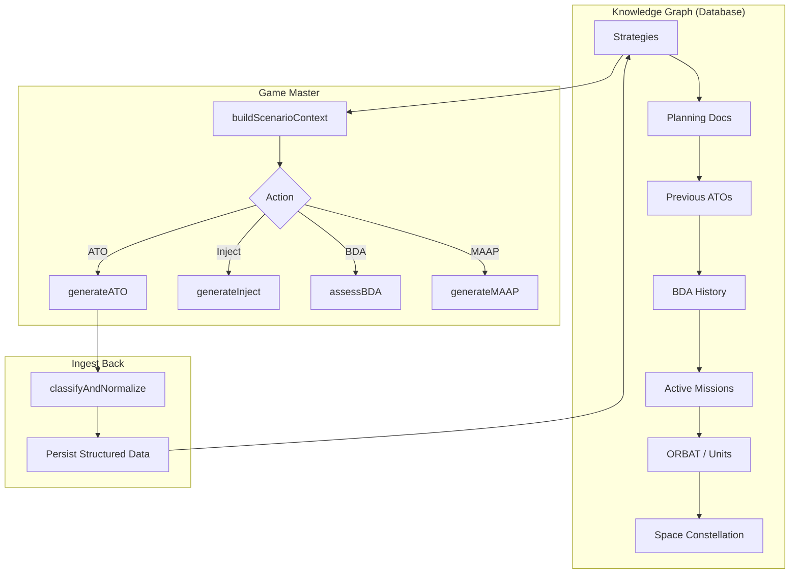

# Game Master Service

The Game Master (`server/src/services/game-master.ts`, 996 lines) is the core of POC #1 Phase 4. It reads the structured knowledge graph (database), generates operational documents on demand, and ingests results back through the doc-ingest pipeline — creating a full **read → generate → ingest back** loop.

## Architecture



## Context Assembly (`buildScenarioContext`)

Before any generation, the Game Master builds a comprehensive context snapshot by querying the database:

| Data Source | Query | Output |
|---|---|---|
| Scenario | Basic details | Theater, adversary, duration |
| Strategy Documents | All by tier | Strategic objectives and guidance |
| Planning Documents | All | JIPTL priorities, MAAP guidance |
| Previous ATOs | By day | Prior day's tasking for continuity |
| Previous BDA | By day | What was assessed and its outcomes |
| ORBAT | All units | Available forces with capabilities |
| Space Assets | With coverage windows | Available space support |
| Recent Injects | Fired injects | Current operational friction |
| Missions | Active/recent | Current ops tempo |

## Core Functions

### `generateATO(scenarioId, atoDay, io?)`

Generates a complete Air Tasking Order for a specific ATO day.

**Flow**:
1. Build scenario context via `buildScenarioContext()`
2. Assemble prompt with `ATO_PROMPT` template (MAAP, ORBAT, previous ATO/BDA, space assets)
3. Call LLM (midRange / o4-mini)
4. Feed generated prose through `classifyAndNormalize()` — the doc-ingest pipeline
5. Pipeline creates: `TaskingOrder` → `MissionPackage[]` → `Mission[]` with `Waypoint[]`, `TimeWindow[]`, `MissionTarget[]`, `SupportRequirement[]`, `SpaceNeed[]`
6. Broadcast progress via Socket.IO (`sim:gameMasterUpdate`)

**Returns**: `GameMasterResult` with:
- `generatedText` — full prose ATO
- `ingestResult` — `{ createdId, documentType, confidence, missionCount }`
- `durationMs` — total processing time

### `generateInject(scenarioId, atoDay, io?)`

Generates context-aware scenario injects (MSEL events).

**Flow**:
1. Build context with current ops tempo, active missions, recent events
2. Generate structured inject data as JSON array
3. Parse and persist as `ScenarioInject` records
4. Types: FRICTION (asset failure/weather), INTEL (threat update), CRISIS (escalation), SPACE (GPS/SATCOM degradation)

### `assessBDA(scenarioId, atoDay, io?)`

Comprehensive Battle Damage Assessment.

**Flow**:
1. Query all missions and targets for the ATO day
2. Generate structured per-target assessment
3. Parse into `BDAAssessment` objects: `{ targetName, damagePercent, functionalKill, restrikeNeeded, effect }`
4. Update `PriorityEntry` records — sufficiently degraded targets drop priority
5. Nominate restrike targets and flag them
6. Generate overall effectiveness narrative

**Returns**: `GameMasterResult` with:
- `bdaResults` — per-target assessments
- `degradedTargets` — list of sufficiently degraded targets
- `restrikeNominations` — targets needing re-attack
- `updatedPriorities` — count of priority updates

### `generateMAAP(scenarioId, io?)`

Master Air Attack Plan generation.

**Flow**:
1. Assemble full ORBAT (air, maritime, space, adversary)
2. Generate MAAP with sortie allocation, target-weapon pairing, support packages
3. Persist as `PlanningDocument` (docType: MAAP) via ingest pipeline

## Integration with Simulation

The simulation engine calls the Game Master via `runGameMasterCycle()` at each ATO day boundary:

1. **Pause** simulation temporarily
2. **BDA**: `assessBDA()` evaluates previous day
3. **ATO**: `generateATO()` creates next day's orders
4. **Space**: `allocateSpaceResources()` resolves contention
5. **Resume** simulation with new orders active

## API Routes

All routes in `server/src/api/game-master.ts`:

| Method | Route | Description |
|---|---|---|
| `POST` | `/api/game-master/:scenarioId/ato` | Generate ATO (body: `{ atoDay }`) |
| `POST` | `/api/game-master/:scenarioId/inject` | Generate inject (body: `{ atoDay }`) |
| `POST` | `/api/game-master/:scenarioId/bda` | Run BDA assessment (body: `{ atoDay }`) |
| `POST` | `/api/game-master/:scenarioId/maap` | Generate MAAP |

## Result Type

All functions return `GameMasterResult`:

```typescript
interface GameMasterResult {
  success: boolean;
  action: 'ato' | 'inject' | 'bda' | 'maap';
  atoDay: number;
  generatedText: string;
  ingestResult?: {
    createdId: string;
    documentType: string;
    confidence: number;
    missionCount?: number;
  };
  bdaResults?: BDAAssessment[];
  degradedTargets: string[];
  restrikeNominations: string[];
  updatedPriorities: number;
  durationMs: number;
  error?: string;
}
```
