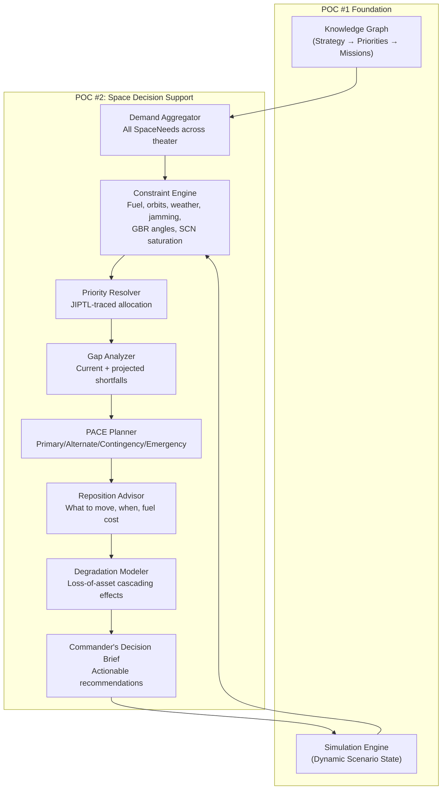
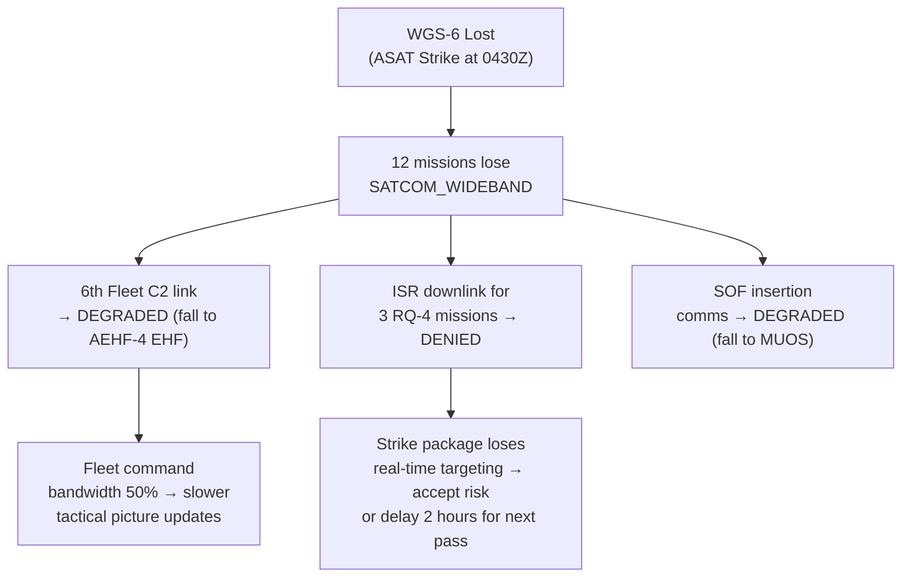

# POC #2 — Space Domain AI Decision Support System

## Vision

Once the wargame is built and the scenario is running, the Combatant Commander needs to provide space support to a dynamic, evolving theater. The 6th Fleet is moving and needs OPIR, GPS, and SATCOM. A bomber package 100 miles away needs the same GPS constellation and wideband SATCOM at the same time. What's the critical window? What's the PACE plan? Can we support both, or do we need to prioritize?

POC #2 is an **AI decision support system** that tells the commander everything they need to know — **up front** — to allocate, protect, and reposition space assets in a contested, degraded environment.

---

## The Problem

Space support is not unlimited. Real-world constraints include:

| Constraint | Impact |
|---|---|
| **Orbital mechanics** | Satellites are only overhead for finite pass windows; LEO passes last ~10 minutes |
| **Fuel budget** | Spacecraft maneuvers consume hydrazine — every repositioning shortens mission life |
| **Ground station saturation** | The Satellite Control Network (SCN) has a finite number of contacts per orbit |
| **GPS jamming** | Adversary GPS denial zones degrade PNT for all assets in the region |
| **SATCOM weather effects** | Ka-band and EHF links degrade in rain, rendering wideband SATCOM unreliable |
| **Adversary ASAT** | Direct-ascent and co-orbital threats can physically destroy or degrade satellites |
| **GBR fixed geometry** | Ground-based radars have fixed elevation masks and azimuth limits |
| **Constellation gaps** | Loss of a single satellite can create hours-long coverage holes |

The commander must reason across all of these simultaneously, against a priority framework driven by the knowledge graph (POC #1), while the operational picture changes in real time.

---

## What It Does

POC #2 extends the existing space pipeline (`space-propagator.ts` → `coverage-calculator.ts` → `space-allocator.ts`) into a full AI-driven decision support layer:



---

## Core Capabilities

### 1. Theater-Wide Demand Aggregation

Collect every `SpaceNeed` across the theater and present a unified demand picture:

- 6th Fleet moving south → needs OPIR (missile warning), GPS_MILITARY (precision nav), SATCOM_PROTECTED (C2), and SATCOM_WIDEBAND (ISR downlink) from 0200Z–1400Z
- Bomber package B-2 strike → needs GPS_MILITARY, SATCOM_PROTECTED, and ISR_SPACE during the same 0600Z–0800Z window
- SOF insertion → needs SATCOM_TACTICAL (MUOS), GPS_MILITARY, and WEATHER from 2200Z–0400Z

The system aggregates demand across time, geography, capability type, and priority — showing the commander the full picture, not just one mission at a time.

### 2. Constraint-Aware Scheduling

Every recommendation must respect real-world physics and operational limits:

| Constraint | Modeling Approach |
|---|---|
| **Orbital passes** | SGP4 propagation of TLEs → `SpaceCoverageWindow` with exact start/end times and max elevation |
| **Fuel state** | Track remaining ΔV per spacecraft; flag when a maneuver would reduce mission-remaining below threshold |
| **Maintenance windows** | Satellites need housekeeping (wheel desaturation, battery conditioning) — these are no-go periods |
| **SCN contacts** | Model contact opportunities per ground station; flag when commanding/telemetry demand exceeds capacity |
| **GBR geometry** | Fixed-site radars have elevation masks — objects below mask angle are invisible; model azimuth and elevation limits |
| **Weather** | Ka-band and EHF SATCOM links degrade above 10 dB rain attenuation; inject weather forecast data to predict outages |
| **GPS jamming zones** | Adversary denial areas where GPS accuracy degrades from 1m to 100m+; map to affected missions |
| **ASAT threat** | Model conjunction geometry and warning timelines for kinetic and co-orbital threats |

### 3. PACE Plan Generation

For every mission with space needs, automatically generate a PACE (Primary / Alternate / Contingency / Emergency) communications and capability plan:

```
Mission: 6th Fleet Transit — OPIR Coverage
├── PRIMARY:    SBIRS GEO-3 (overhead 0200Z–1400Z, max elev 72°)
├── ALTERNATE:  SBIRS GEO-5 (partial coverage 0200Z–0800Z, max elev 34°)
├── CONTINGENCY: Theater OPIR from ground-based FPS-132 (limited to >5° elevation)
└── EMERGENCY:  Request coalition partner STSS relay (24hr lead time)

Mission: 6th Fleet Transit — SATCOM
├── PRIMARY:    WGS-6 (SHF wideband, 0200Z–1200Z)
├── ALTERNATE:  AEHF-4 (EHF protected, 0400Z–1400Z, lower bandwidth)
├── CONTINGENCY: MUOS-3 (UHF tactical, degraded throughput)
└── EMERGENCY:  HF radio relay via shore station
```

The PACE plan is **dynamic** — if SBIRS GEO-3 gets destroyed by ASAT, the system immediately activates the ALTERNATE and recalculates downstream allocations.

### 4. Simultaneous Support Analysis

**Can we support both the fleet movement and the bomber run?**

The system performs multi-mission deconfliction:

- Map all needs to available coverage windows
- Identify contention (same satellite, same time, different missions)
- Resolve by **JIPTL-traced priority** from the knowledge graph:
  - If the bomber run targets Priority 1 (IADS neutralization) and the fleet transit is Priority 3 (force positioning) → bomber gets GPS_MILITARY on GPS-III-SV05; fleet falls back to standard GPS
  - If both are Priority 1 → system recommends splitting resources or flagging for commander decision
- Show the commander: "We can fully support both, **except** SATCOM_WIDEBAND from 0600Z–0800Z where we have a 47-minute gap for the fleet. Recommend repositioning WGS-8 at cost of 1.2 m/s ΔV (3% of remaining fuel budget)."

### 5. Asset Loss Cascading Effects

**What happens if we lose WGS-6?**

The degradation modeler traces the cascading impact:



The system immediately:
1. Identifies all affected `SpaceAllocation` records
2. Activates PACE fallbacks where available
3. Recalculates coverage gaps with remaining constellation
4. Generates a **priority-ordered recommendation list** for the commander

### 6. Repositioning & Maintenance Advisory

**When can we do station-keeping without impacting operations?**

The system identifies maintenance and repositioning windows by analyzing demand patterns:

- "WGS-4 has a 6-hour low-demand window starting 1800Z — recommend wheel desaturation during this period"
- "Repositioning SBIRS HEO-3 to improve Southern Pacific coverage will cost 2.8 m/s ΔV and create a 45-minute OPIR gap over the Taiwan Strait. The gap overlaps with SBIRS GEO-5 coverage — no operational impact. **Recommend proceed.**"
- "GPS-III-SV09 fuel state: 14% remaining. At current maneuver rate, end-of-life in ~8 months. Recommend reducing repositioning frequency and relying on constellation geometry for coverage."

### 7. Commander's Decision Brief

Everything above rolls up into a single, actionable brief:

```
═══════════════════════════════════════════════════════════
  SPACE SUPPORT DECISION BRIEF — ATO Day 3, 0600Z Update
═══════════════════════════════════════════════════════════

OVERALL SPACE SUPPORT: DEGRADED (was FULL at 0000Z)
  Cause: WGS-6 lost to ASAT at 0430Z

CRITICAL DECISIONS REQUIRED:
  1. ISR downlink for RQ-4 missions — DENIED until 0800Z
     → RECOMMEND: Delay strike PKG-A04 by 2 hours
     → RISK IF IGNORED: Strike proceeds without real-time BDA

  2. SATCOM contention 0900Z–1100Z (Fleet vs. SOF)
     → Fleet = Priority 1, SOF = Priority 2
     → RECOMMEND: Allocate AEHF-4 to Fleet, MUOS to SOF
     → BOTH SUPPORTABLE with degraded SOF bandwidth

REPOSITIONING RECOMMENDATIONS:
  • Move WGS-8 to cover WGS-6 gap (1.2 m/s ΔV, 3% fuel)
    → Creates coverage from 0900Z, fills gap by 1100Z
  • No action on GPS constellation (fully redundant)

MAINTENANCE WINDOWS:
  • AEHF-2: Safe for desaturation 1400Z–1800Z (no demand)
  • SBIRS HEO-1: Battery conditioning 2200Z–0200Z (backup by GEO-3)

NEXT WATCH ITEMS:
  • GPS jamming zone expanding NW — monitor GPS-III-SV05 impact
  • Typhoon approaching: Ka-band SATCOM unreliable by Day 4
  • PLASSF launch prep detected — potential ASAT in 36 hours
═══════════════════════════════════════════════════════════
```

---

## Data Model Extensions

POC #2 builds on the existing space models. Net-new models required:

| Model | Purpose |
|---|---|
| `SpaceConstraint` | Fuel state, maintenance schedule, SCN contact limits per asset |
| `PACEPlan` | Primary/Alternate/Contingency/Emergency for each SpaceNeed |
| `DegradationScenario` | Pre-computed cascading effects of losing each asset |
| `RepositionOption` | Proposed maneuver with ΔV cost, coverage impact, risk rating |
| `SpaceDecisionBrief` | Rolled-up commander's brief with action items and risk |
| `JammingZone` | Geographic polygon with affected capability and severity |
| `WeatherImpact` | Forecast-driven SATCOM degradation by band and region |

**Extended existing models:**
- `SpaceAsset` → add `fuelRemainingPct`, `maintenanceDue`, `lastManeuverDate`, `scnContactsPerDay`
- `SpaceAllocation` → add `paceRole` (PRIMARY / ALTERNATE / CONTINGENCY / EMERGENCY), `activatedAt`
- `SpaceCoverageWindow` → add `qualityScore` (elevation + weather + jamming composite)

---

## Integration with POC #1

POC #2 is inseparable from the knowledge graph:

| POC #1 Output | POC #2 Usage |
|---|---|
| `StrategyPriority` chain | Drives allocation priority when two missions compete for the same satellite |
| `PriorityEntry` targets | Determines which mission's space needs get fulfilled first |
| `SpaceNeed` per mission | Input demand signal to the constraint engine |
| Game Master BDA results | If a target is destroyed, its space needs are released back to the pool |
| MSEL injects (SPACE type) | Trigger degradation scenarios (ASAT, jamming, weather) |

---

## Realism Constraints Baked In

Every recommendation must be grounded in physics and operational truth:

- **Satellites can't teleport** — repositioning takes hours to days, consumes fuel, and the asset is often offline during maneuver
- **GBRs don't rotate** — AN/FPS-132 has a fixed 120° azimuth coverage; you can't point it somewhere else
- **SCN is a bottleneck** — you can't command 50 satellites through 6 ground stations simultaneously
- **GPS jamming is area-effect** — when adversary jams GPS in the Taiwan Strait, every mission in that area is affected, not just one
- **Weather doesn't care about your mission** — Ka-band rainout happens whether you planned for it or not
- **ASAT warning is finite** — you might get 30 minutes of conjunction warning, or you might get none
- **Fuel is life** — every m/s of ΔV you spend repositioning is ΔV you don't have for collision avoidance later

---

## Implementation Phases

### Phase 1: Constraint Engine & Enhanced Allocation
Extend `space-allocator.ts` to model fuel, maintenance, weather, and jamming constraints. Add constraint-aware scoring to coverage windows.

### Phase 2: PACE Plan Generation
Auto-generate PACE plans for every `SpaceNeed`. Integrate fallback activation when primary assets are lost.

### Phase 3: Multi-Mission Deconfliction
Build the simultaneous support analyzer — can we support N missions concurrently? Where are the hard conflicts?

### Phase 4: Degradation Modeling
Pre-compute cascading effects for every space asset. When an asset is lost (SimEvent: SATELLITE_DESTROYED), instantly recalculate all allocations and activate PACE fallbacks.

### Phase 5: Repositioning Advisor
Model ΔV costs, maneuver timelines, and coverage trade-offs. Identify maintenance windows that don't conflict with operations.

### Phase 6: Commander's Decision Brief
Roll everything into a single AI-generated brief. Natural language, actionable, grounded in the knowledge graph priority chain.

---

## What POC #2 Proves

1. **AI can reason across the full space operations problem** — from orbital mechanics to commander-level decision support — in real time.
2. **Priority-driven allocation works under stress** — when assets are lost and the constellation degrades, the system automatically reallocates by JIPTL-traced priority, not first-come-first-served.
3. **PACE planning can be automated** — every mission gets a multi-layer fallback plan grounded in actual coverage windows, not notional backup systems.
4. **The commander gets what they need up front** — not a spreadsheet of satellite passes, but a brief that says "you have a problem at 0600Z, here's what to do about it, and here's what it costs."
