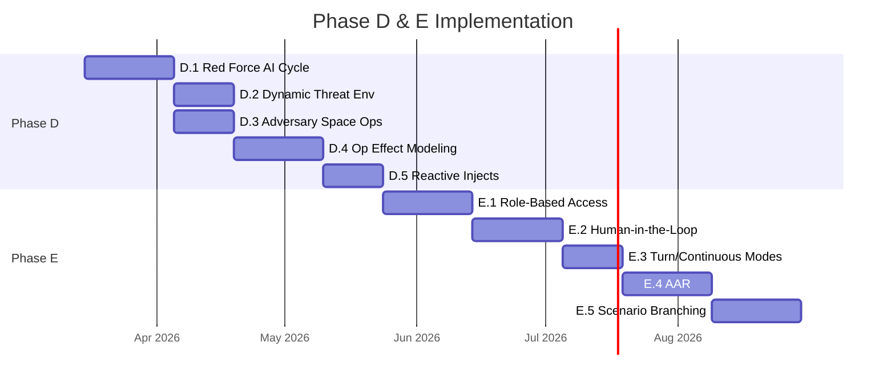

# Phase D & E Roadmap

This document defines the remaining two phases of Overwatch development. Phases A–C and POC #1 are complete. These phases build on the established architecture to transform Overwatch from a single-player AI-driven simulation into a full collaborative wargaming platform.

---

## Phase D: Adversary Modeling & Red Force Autonomy

**Goal**: Make the Red Force dynamic. Currently, adversary units are static ORBAT entries. Phase D adds AI-driven adversary behavior so the simulation becomes a real two-sided wargame.

### D.1 — Red Force AI Decision Cycle

Create an adversary "Game Master" that generates Red Force reactions to Blue operations.

**New service**: `red-force-engine.ts`

| Function | Description |
|---|---|
| `assessBlueOperations()` | Analyze Blue Force ATO, mission tracks, and BDA to understand current Blue ops tempo |
| `generateRedReaction()` | AI-generated adversary decisions: repositioning, counter-attack, dispersal, deception |
| `updateRedForcePositions()` | Reposition Red units based on AI decisions |
| `generateRedInject()` | Create adversary-initiated injects (counter-attacks, spoofing, force movement) |

**Data model changes**:
- Add `RedForceOrder` model — mirrors `TaskingOrder` for adversary operations
- Add `red_force_decisions` table for adversary AI reasoning audit trail
- Add `adversaryPosture` enum: DEFENSIVE, OFFENSIVE, DISPERSED, DECEPTION

**Integration**: Called by simulation engine alongside Blue Game Master cycle at day boundaries. Red reactions are influenced by Blue BDA results — if Blue degrades a target, Red may disperse or reinforce.

### D.2 — Dynamic Threat Environment

Make IADS and threat status respond to Blue operations.

| Feature | Description |
|---|---|
| SAM engagement zones | Dynamic threat rings that update when SEAD missions degrade SAM sites |
| Air defense status | Track from FULLY_OPERATIONAL → DEGRADED → DESTROYED based on BDA |
| EW environment | Jamming zones that activate/deactivate based on adversary EW assets |
| Sea denial zones | Maritime threat areas from adversary ASCMs and submarine positions |

**Data model changes**:
- Add `ThreatZone` model with geometry (polygon), status, threat type, and contributing assets
- Add `threat_assessment` field to `Mission` for per-mission threat level

### D.3 — Adversary Space Operations

Model adversary counter-space capabilities.

| Capability | Effect |
|---|---|
| Direct-ascent ASAT | Destroy satellites (create `SimEvent` type: SATELLITE_DESTROYED) |
| Co-orbital ASAT | Degrade satellites by approach/docking |
| GPS jamming | Regional GPS degradation zones (degrade `SpaceNeed` fulfillment) |
| SATCOM interference | Reduce comms bandwidth in affected areas |
| Dazzling/blinding | Temporary ISR satellite degradation |

**Data model changes**:
- Add `CounterSpaceEvent` model with type, affected region, duration, and impacted capabilities
- Extend `SpaceAllocator` to account for adversary interference when resolving allocations

### D.4 — Operational Effect Modeling

Move beyond time-driven mission status to outcome-driven results.

| Feature | Description |
|---|---|
| Mission success probability | Based on force correlation, threat environment, space support |
| Weapon-target pairing effectiveness | Platform × weapon × target type effectiveness matrix |
| Attrition modeling | Probability of Blue losses per mission based on threat density |
| Logistics depletion | Sortie generation rates, weapon stocks, fuel availability |

**Data model changes**:
- Add `MissionOutcome` model with success probability, BDA results, losses
- Add `logistics_state` to `Unit` for sortie generation tracking

### D.5 — Reactive Injects

Make MSEL injects context-aware — responding to actual scenario state.

| Current | Phase D |
|---|---|
| Static injects on fixed day/hour | Conditional injects triggered by scenario state |
| Pre-scripted friction | AI-generated friction based on emerging situation |
| Fixed impact text | Dynamic impact assessment based on current ops |

**Data model changes**:
- Add `triggerCondition` (JSON) to `ScenarioInject` — conditions that must be met for inject to fire
- Add `conditionType` enum: TIME_BASED (current), STATE_BASED, THRESHOLD_BASED

---

## Phase E: Multi-User Collaborative Wargaming

**Goal**: Transform from single-user AI-everything to multi-user human-in-the-loop collaborative wargaming.

### E.1 — Role-Based Access

Define distinct user roles with appropriate views and permissions.

| Role | Responsibilities | Primary Views |
|---|---|---|
| **White Cell / EXCON** | Exercise control, inject scheduling, simulation management | Dashboard, Injects, Scenario Setup |
| **JFACC** | Joint Force Air Component Commander — ATO approval | Orders, Map, Decisions |
| **MOC Commander** | Maritime Operations Center — MTO approval | Map (maritime filter), Orders |
| **CSpOC** | Combined Space Operations Center — space allocation | Space Dashboard, Allocations |
| **Intel** | BDA assessment, threat updates | Hierarchy, Knowledge Graph, Intake |
| **Observer** | Read-only view of all data | All views (read-only) |

**Data model changes**:
- Add `User` model with role, permissions, assigned scenario
- Add `user_id` FK to `LeadershipDecision`, `TaskingOrder` (for approval tracking)
- Add `approved_by` and `approved_at` to `TaskingOrder`

### E.2 — Human-in-the-Loop Decisions

Add human approval gates to AI-generated operations.

| Feature | Description |
|---|---|
| ATO approval workflow | AI generates → Commander reviews → Approves/modifies → Published |
| BDA review | Intel reviews AI BDA → Confirms/adjusts → Feeds next cycle |
| COA selection | AI generates COAs → Commander selects → Execution begins |
| Decision points | MSEL injects requiring human resolution with time pressure |

**Flow**:
```
AI generates ATO draft → Socket.IO notification → Commander reviews
  → Approve → Orders published, simulation continues
  → Modify → Updated ATO re-ingested → Orders published
  → Reject → AI regenerates with commander's guidance
```

### E.3 — Turn-Based & Continuous Modes

Support both structured turn-based (NATO-style exercise) and free-running continuous simulation.

| Mode | Description |
|---|---|
| **Continuous** (current) | Real-time simulation with AI handling everything |
| **Turn-Based** | Pause at decision points, wait for human input, advance |
| **Hybrid** | Continuous with automatic pause at DECISION_POINT injects |

### E.4 — After Action Review (AAR)

Full scenario replay with analysis tools.

| Feature | Description |
|---|---|
| Timeline scrubbing | Replay any point in the scenario with full state reconstruction |
| Decision audit trail | Every decision traceable: who, when, what, why, what happened |
| NLQ analytics | "How many sorties targeted Priority 1 on Day 3?" "What was the BDA for Bridge Alpha?" |
| Comparative analysis | Side-by-side comparison of different COA outcomes |
| Heat maps | Mission density, threat exposure, coverage gaps over time |

**Data model changes**:
- Add `AARSnapshot` model — scenario state at key decision points
- Add `timeline_markers` to `SimulationState` for bookmarking moments of interest

### E.5 — Scenario Branching

Explore alternative courses of action by branching scenario state.

| Feature | Description |
|---|---|
| Save state | Snapshot full scenario state at any decision point |
| Branch | Create divergent scenario from saved state |
| Compare | Run both branches, compare outcomes |
| Merge | Select preferred outcome path |

**Data model changes**:
- Add `ScenarioBranch` model with parent scenario reference and branch point timestamp
- Add `branch_id` to major entities for tracking which branch data belongs to

---

## Implementation Priority

Recommended implementation order based on dependencies and impact:



**Phase D total**: ~12 weeks  
**Phase E total**: ~14 weeks  
**Combined**: ~26 weeks (6 months)
