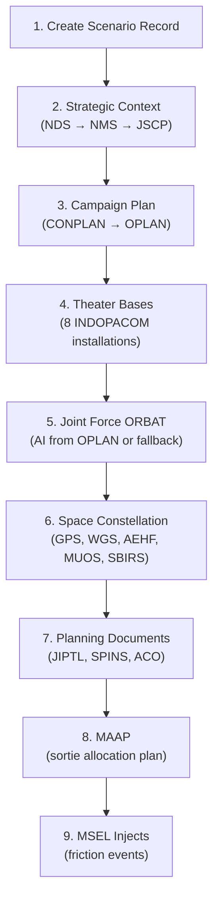

# Scenario Generation Pipeline

## Overview

`generateFullScenario()` orchestrates the creation of a complete multi-domain military scenario in 9 sequential steps. Each step builds on the outputs of previous steps, creating a coherent scenario from strategic guidance down to individual mission injects.

## Pipeline Steps



---

### Step 1: Create Scenario Record

**Function**: Inline `prisma.scenario.create()`

Creates the root `Scenario` record with:
- Name, description, theater, adversary
- Start/end dates (derived from `duration`)
- Classification (defaults to `UNCLASSIFIED`)

All subsequent entities cascade-reference this scenario ID.

---

### Step 2: Strategic Context Cascade

**Function**: `generateStrategicContext()`  
**Model**: `flagship` (o3)  
**Creates**: 3 `StrategyDocument` records (NDS, NMS, JSCP)

Generates the top 3 tiers of the doctrine cascade. Each document receives its parent's full text as context. See [Doctrine Cascade](./doctrine-cascade.md) for details.

---

### Step 3: Campaign Plan

**Function**: `generateCampaignPlan()`  
**Model**: `midRange` (o4-mini)  
**Creates**: 2 `StrategyDocument` records (CONPLAN, OPLAN)

Extends the cascade with operational planning documents. The OPLAN includes an embedded `FORCE_SIZING_TABLE` in JSON format that drives Step 5's ORBAT generation.

---

### Step 4: Theater Bases

**Function**: `generateBases()`  
**Model**: None (deterministic)  
**Creates**: 8 `Base` records

Inserts real-world INDOPACOM installations with accurate coordinates:

| Base | Type | Country | ICAO |
|---|---|---|---|
| Kadena AB | AIRBASE | Japan | RODN |
| Andersen AFB | AIRBASE | Guam | PGUA |
| Yokota AB | AIRBASE | Japan | RJTY |
| Misawa AB | AIRBASE | Japan | RJSM |
| MCAS Iwakuni | AIRBASE | Japan | RJOI |
| Naval Station Yokosuka | NAVAL_BASE | Japan | — |
| Joint Base Pearl Harbor-Hickam | JOINT_BASE | USA | PHJR |
| Camp Humphreys | JOINT_BASE | South Korea | — |

---

### Step 5: Joint Force ORBAT

**Function**: `generateJointForce()`  
**Model**: None (deterministic parsing + fallback)  
**Creates**: `Unit`, `Asset`, `AssetType` records

**Primary path**: Parses the `FORCE_SIZING_TABLE` from the OPLAN (Step 3) to create Blue Force units matching the AI-generated force sizing.

**Fallback path**: If parsing fails, uses a hardcoded ORBAT with:
- F-35A, F-22A, EA-18G, KC-135, E-3G (air)
- DDG-51, CG-47, SSN-774, LCS (maritime)

Red Force units are always hardcoded (adversary air regiments, SAM battalions, naval groups).

Also creates the **platform comms catalog** (`AssetType.commsSystems`) which drives automatic SpaceNeed generation.

---

### Step 6: Space Constellation

**Function**: `generateSpaceConstellation()`  
**Model**: None (deterministic)  
**Creates**: `SpaceAsset` records

Creates realistic space assets across 5 constellations:

| Constellation | Assets | Capabilities |
|---|---|---|
| GPS III | 6 satellites | GPS, PNT |
| WGS | 3 satellites | SATCOM_WIDEBAND |
| AEHF | 2 satellites | SATCOM_PROTECTED |
| MUOS | 2 satellites | SATCOM_TACTICAL |
| SBIRS | 2 satellites | OPIR |

Each satellite includes realistic orbital parameters (inclination, eccentricity, period, apogee/perigee).

---

### Step 7: Planning Documents

**Function**: `generatePlanningDocuments()`  
**Model**: `midRange`  
**Creates**: 3 `PlanningDocument` records (JIPTL, SPINS, ACO) + `PriorityEntry` records

- **JIPTL** (Joint Integrated Prioritized Target List) — ranked target priorities with justifications
- **SPINS** (Special Instructions) — ROE, airspace control, comm procedures
- **ACO** (Airspace Control Order) — air corridors, restricted areas, coordination measures

The JIPTL priorities directly feed mission package prioritization in daily orders.

---

### Step 8: MAAP

**Function**: `generateMAAP()`  
**Model**: `midRange`  
**Creates**: 1 `PlanningDocument` (docType: MAAP)

The Master Air Attack Plan bridges OPLAN + JIPTL to daily ATO generation:
- Correlates JIPTL priorities with ORBAT sortie capacity
- Allocates sorties per priority per campaign phase
- Identifies space support requirements
- Defines flow plan (tanker tracks, AWACS rotation)
- Establishes assessment criteria (MOE/MOP)

---

### Step 9: MSEL Injects

**Function**: `generateMSELInjects()`  
**Model**: `midRange`  
**Creates**: `ScenarioInject` records (8–30 per scenario)

Generates Master Scenario Events List friction events distributed across all scenario days:

| Category | Examples |
|---|---|
| FRICTION | Equipment failure, weather, tanker divert, logistics |
| INTEL | SIGINT intercept, adversary repositioning, HUMINT tip |
| CRISIS | Civilian incident, escalation, ROE change, political constraint |
| SPACE | GPS jamming, SATCOM interference, debris threat, cyber attack |

Higher density in Phase 2–3 (most intense combat operations). Falls back to 4 hardcoded injects if LLM parsing fails.

---

## Input Parameters

```typescript
interface GenerateScenarioOptions {
  name: string;           // Scenario display name
  theater: string;        // e.g. "INDOPACOM — Western Pacific"
  adversary: string;      // e.g. "People's Republic of China (PRC)"
  description: string;    // Free-text scenario description
  duration: number;       // Scenario length in days (e.g. 10)
  compressionRatio: number; // Sim time compression (default 720)
}
```

## Timing

Full scenario generation takes approximately **2–4 minutes** depending on LLM response times. The flagship model (o3) is used only for the strategic context cascade (Step 2), which is the slowest step. All other AI steps use the faster midRange model.
