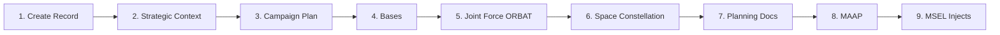

# Scenario Generation Pipeline

The `generateFullScenario()` function orchestrates a 9-step LLM pipeline that transforms a scenario description into a fully populated wargame database. Pipeline execution takes 2–4 minutes for a typical scenario.

## Pipeline Overview



## Step Details

### Step 1: Create Scenario Record
**AI**: None
**Creates**: `Scenario` entity with generation tracking fields.
**Status Tracking**: Sets `generationStatus = GENERATING`, `generationProgress = 0`.

### Step 2: Strategic Context
**AI**: `flagship` (o3)
**Creates**: 5× `StrategyDocument` (NDS, NMS, JSCP, CONPLAN, OPLAN) with parent-child cascade linkage + `StrategyPriority` entries for each document.
**Context**: Theater, adversary, scenario description.
**Schema**: Enforced via `llm-schemas.ts` strategic context schema.

### Step 3: Campaign Plan
**AI**: `midRange` (o4-mini)
**Creates**: 2× `StrategyDocument` (JFC_GUIDANCE, COMPONENT_GUIDANCE)
**Context**: Full strategic context from Step 2 (NDS→OPLAN content).

### Step 4: Bases
**AI**: `midRange`
**Creates**: ~8× `Base` entries with coordinates, ICAO codes, country.
**Context**: Theater of operations, OPLAN content.

### Step 5: Joint Force ORBAT
**AI**: `midRange`
**Creates**: Multiple `Unit` entities with `Asset` assignments per unit.
**Context**: Theater, adversary, bases from Step 4, plus extensive `reference-data.ts` — 2,270+ lines of INDOPACOM Blue Force units, adversary (PLASSF, PLAAF, PLAN) forces, and platform catalogs including comms systems (EHF/SHF/UHF), GPS types, and data links.

### Step 6: Space Constellation
**AI**: `midRange`
**Creates**: `SpaceAsset` entries (friendly + adversary) with TLE data, capabilities, orbital parameters, operator, coverage region, bandwidth.
**Context**: Theater, ORBAT, OPLAN.

### Step 7: Planning Documents
**AI**: `midRange`
**Creates**: `PlanningDocument` entries (JIPTL, ACO, SPINS, component priorities) + `PriorityEntry` records with traced lineage to `StrategyPriority` entries.
**Context**: OPLAN content, strategic priorities.

### Step 8: MAAP
**AI**: `midRange`
**Creates**: `PlanningDocument` (MAAP type) with sortie allocation, target-weapon pairing, support packages.
**Context**: JIPTL priorities, OPLAN, ORBAT, space constellation.

### Step 9: MSEL Injects
**AI**: `midRange`
**Creates**: `ScenarioInject` entries distributed across scenario duration.
**Fields**: CJCSM 3500.03F doctrine-compliant (serialNumber, mselLevel, injectMode, fromEntity, toEntity, expectedResponse, objectiveTested).
**Context**: Full scenario state, OPLAN phase, ORBAT, space assets.

## Generation Audit Trail

Every LLM call is logged to `GenerationLog`:

| Field | Purpose |
|---|---|
| `step` | Pipeline step name |
| `artifact` | Generated entity type (NDS, CONPLAN, JIPTL, etc.) |
| `model` | LLM model used |
| `promptTokens` / `outputTokens` | Token usage |
| `outputLength` | Response character count |
| `durationMs` | Wall-clock time |
| `retryCount` | Retry attempts |
| `status` | success / placeholder / error / retry |
| `rawOutput` | Full LLM response (for debugging) |

## Real-Time Progress Tracking

The client polls `GET /api/scenarios/:id/generation-status` during pipeline execution:

```json
{
  "generationStatus": "GENERATING",
  "generationStep": "Planning Documents",
  "generationProgress": 72,
  "generationError": null
}
```

Progress is updated after each step completes. On failure, `generationStatus` is set to `FAILED` with the error message in `generationError`.

## Error Handling

- Each step uses try/catch with fallback to placeholder content
- Placeholder content allows the pipeline to continue even if individual steps fail
- Failed steps are logged as `status: 'placeholder'` in `GenerationLog`
- The scenario is marked `COMPLETE` even with placeholders, so partial scenarios are usable
