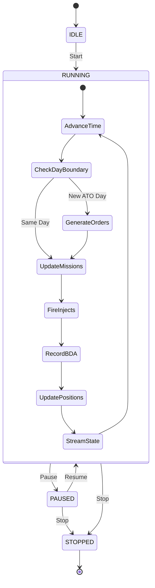

# Simulation Engine

## Overview

The simulation engine (`simulation-engine.ts`) drives real-time execution of generated scenarios. It advances simulation time, updates platform positions along waypoints, processes MSEL injects, and streams state to the frontend via WebSocket.

## Time Compression

| Setting | Value | Description |
|---|---|---|
| Default Ratio | 720 | 1 real minute = 12 simulated hours |
| Min Ratio | 1 | Real-time |
| Max Ratio | 1440 | 1 real minute = 1 simulated day |

Configurable per scenario via `SimulationState.compressionRatio`.

## Simulation Loop



### 1. Advance Time
Increments `SimulationState.simTime` based on compression ratio and real elapsed time.

### 2. Check Day Boundary
When `simTime` crosses an ATO day boundary (0000Z), triggers `generateDayOrders()` for the new day. Updates `SimulationState.currentAtoDay`.

### 3. Generate Orders
Calls `generateDayOrders(scenarioId, atoDay)` — see [Daily Tasking Cycle](./daily-tasking.md).

### 4. Update Missions
Advances mission status through the lifecycle:
```
PLANNED → BRIEFED → LAUNCHED → AIRBORNE → ON_STATION → ENGAGED → EGRESSING → RTB → RECOVERED
```

Status transitions are time-driven based on waypoint ETAs.

### 5. Fire MSEL Injects

`fireScheduledInjects(io)` checks `ScenarioInject` records against the current sim time:

- Fires injects where `triggerDay <= currentAtoDay` and `triggerHour <= simHour` and `fired = false`
- Sets `fired = true` and `firedAt = simTime`
- Applies domain-specific effects:

| Inject Type | Effect | Target |
|---|---|---|
| `SPACE` | Degrades a random operational SpaceAsset → creates `SATELLITE_JAMMED` SimEvent | SpaceAsset |
| `FRICTION` | Delays a random active mission → creates `MISSION_DELAYED` SimEvent | Mission |
| `INTEL` | Creates `INTEL_UPDATE` SimEvent (advisory) | Scenario |
| `CRISIS` | Creates `CRISIS_EVENT` SimEvent (advisory, no asset effect) | Scenario |

- Emits `inject:fired` WebSocket event with full inject details

### 6. Record BDA

`recordBDA(io)` captures battle damage assessment for completed missions:

- Queries missions with status `COMPLETE` that lack a `BDA_RECORDED` SimEvent
- Creates `BDA_RECORDED` SimEvent with mission callsign, type, and target summary
- Emits `bda:recorded` WebSocket event with count  
- BDA records feed back into the next day's `generateDayOrders()` context via `{prevDayBDA}`

### 7. Update Positions
Interpolates platform positions along waypoint routes based on current sim time. Creates `PositionUpdate` records with:
- Lat/lon/altitude interpolated between waypoints
- Heading and speed calculated from segment geometry
- Current `MissionStatus`
- Fuel state estimate

### 8. Stream State
Broadcasts current state via WebSocket (Socket.IO):
- Active mission positions
- Space asset coverage windows
- Fired injects
- Simulation clock

## Space Asset Propagation

The `space-propagator.ts` service uses SGP4 orbital mechanics to compute real-time satellite positions from TLE data. Positions feed into `coverage-calculator.ts` which determines ground coverage windows for each capability type.

## Coverage Calculator

`coverage-calculator.ts` computes when each space asset can provide coverage to a given ground location:

- **Line-of-sight** calculation from satellite position to target coordinates
- **Elevation angle** filtering (minimum useful elevation)
- **Coverage window** creation with start/end times, max elevation, swath width
- **Gap analysis** — identifies periods with no coverage for critical capabilities

Results populate `SpaceCoverageWindow` records and feed into STO generation.

## Decision Advisor

`decision-advisor.ts` provides AI-powered decision support:

1. **Situation Assessment** — evaluates current operational picture
2. **COA Generation** — produces 2–3 courses of action
3. **Risk Analysis** — identifies risks per COA
4. **Recommendation** — ranks COAs with rationale

Creates `LeadershipDecision` records in `PROPOSED` status. Users can approve/execute or reject recommendations.
