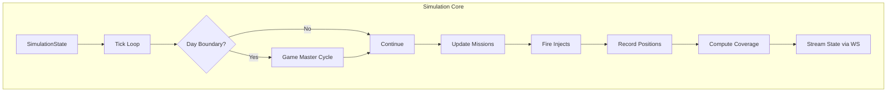

# Simulation Engine

The simulation engine (`simulation-engine.ts`, ~1,300 lines) manages real-time execution of scenarios with time compression, mission status progression, position interpolation, MSEL inject firing, space coverage computation, and the Game Master AI cycle.

## Architecture



## Time Compression

The simulation compresses real time into simulated time:

| Ratio | Effect | Use Case |
|---|---|---|
| 60× | 1 real min = 1 sim hr | Detailed tactical view |
| 360× | 1 real min = 6 sim hrs | Fast operational tempo |
| 720× | 1 real min = 12 sim hrs | Default — 1 ATO day per 2 min |
| 1440× | 1 real min = 1 sim day | Rapid overview |
| 3600× | 1 real min = 2.5 sim days | Sprint through multi-day scenarios |

The compression ratio is adjustable on-the-fly via `setSpeed()`.

## Simulation Lifecycle

### Start (`startSimulation`)
1. Query scenario + all artifacts
2. Find or create `SimulationState` record
3. Set status = RUNNING, simTime = scenario.startDate
4. Start the tick interval

### Pause / Resume
- Pause sets status = PAUSED, stops tick interval
- Resume sets status = RUNNING, restarts tick interval

### Stop
- Sets status = STOPPED, clears tick interval

### Seek (`seekTo`)
- Jump to a specific sim time
- Useful for reviewing past events or skipping ahead

### Speed Change (`setSpeed`)
- Adjusts compression ratio without stopping simulation

## Tick Loop

Each tick (runs at ~1s real-time intervals):

1. **Advance time**: `simTime += compressionRatio * tickIntervalMs`
2. **Check day boundary**: If `currentAtoDay` has changed → trigger Game Master cycle
3. **Update missions**: Progress mission status through state machine
4. **Fire injects**: Check for injects matching current day/hour → fire and broadcast
5. **Record BDA**: Track mission results
6. **Update positions**: Interpolate positions for active missions along waypoint tracks
7. **Compute coverage**: Run SGP4 propagation for space assets, detect coverage gaps
8. **Stream state**: Broadcast all updates via Socket.IO

## Game Master Cycle (`runGameMasterCycle`)

Triggered on ATO day boundaries, the Game Master cycle replaces simple `generateDayOrders()` with a full closed-loop AI pipeline:

1. **Pause simulation** temporarily
2. **Assess BDA** (`assessBDA()`) — evaluate previous day's mission results
3. **Generate new ATO** (`generateATO()`) — create next day's air tasking order
4. **Run space allocation** (`allocateSpaceResources()`) — resolve space resource contention
5. **Resume simulation** with new orders active

All generated documents are ingested back through the doc-ingest pipeline, creating proper structured data (TaskingOrder → MissionPackage → Mission with Waypoints, Targets, SpaceNeeds).

## Mission Status Progression

Missions transition through states based on elapsed time and waypoint proximity:

```
PLANNED → BRIEFED → LAUNCHED → AIRBORNE → ON_STATION → ENGAGED → EGRESSING → RTB → RECOVERED
```

Branch states: `CANCELLED`, `DIVERTED`, `DELAYED`

Transitions are driven by:
- **Time windows**: Mission TOT, on-station, off-station times
- **Waypoint progress**: Interpolated position along the waypoint track
- **Inject effects**: MSEL injects can change mission status (e.g., DIVERTED)

## Position Interpolation

Active missions have positions interpolated between waypoints:

1. Calculate elapsed time since mission launch
2. Determine current segment (which waypoints the mission is between)
3. Linear interpolate lat/lon/alt between segment endpoints
4. Apply heading and speed from segment geometry

Positions are:
- Persisted as `PositionUpdate` records (time-series)
- Broadcast via `sim:positions` WebSocket event

## Space Coverage Computation (`computeAndBroadcastCoverage`)

Every N ticks, the engine computes satellite coverage:

1. **Propagate positions**: Run SGP4 for each `SpaceAsset` with TLE data
2. **Compute coverage windows**: Calculate elevation angles and line-of-sight
3. **Detect gaps**: Identify periods/areas with no coverage for required capabilities
4. **Track contention**: Flag overlapping demands on same capability
5. **Broadcast**: Send coverage update via `sim:coverage` WebSocket event

The cycle tracks `coverageCycleCount` and `lastKnownGaps` for efficient incremental updates.

## MSEL Inject Firing

Each tick checks `ScenarioInject` records where `triggerDay == currentAtoDay` and `triggerHour <= currentHour` and `fired == false`:

1. Mark inject as fired (`fired = true`, `firedAt = simTime`)
2. Broadcast via `sim:inject` WebSocket event
3. Apply operational effects (mission diversions, asset status changes, etc.)

## Integration Points

| System | Integration |
|---|---|
| **Game Master** | `runGameMasterCycle()` on day boundaries |
| **Space Allocator** | `allocateSpaceResources()` per ATO day |
| **Coverage Calculator** | `computeAndBroadcastCoverage()` per N ticks |
| **Decision Advisor** | Feeds situation data for AI assessment |
| **Socket.IO** | Real-time broadcast of all state changes |
