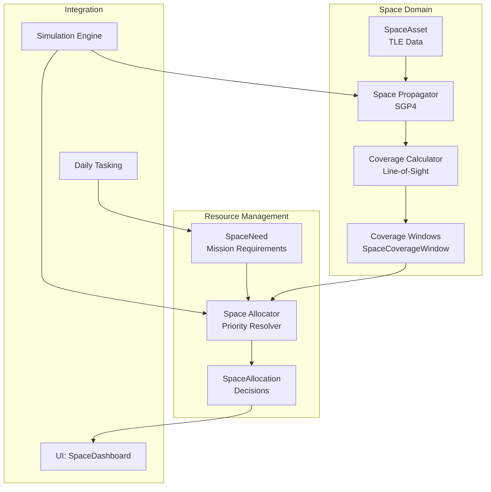
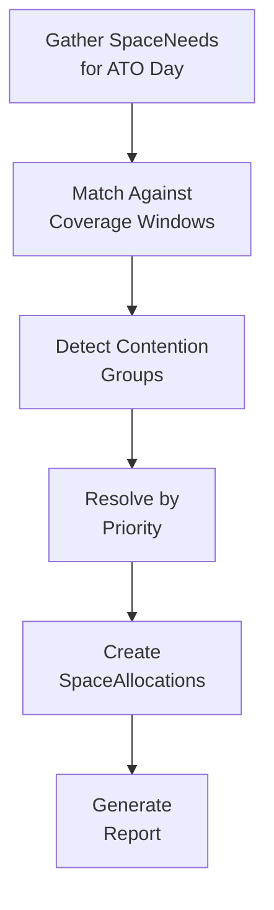

# Space Operations

Overwatch includes comprehensive space domain modeling — from orbital mechanics to resource allocation. This document covers the three space services and their integration with the simulation and tasking cycles.

## Architecture



---

## Space Propagator (`space-propagator.ts`)

Calculates satellite positions from Two-Line Element (TLE) sets using the SGP4 algorithm.

### Key Functions
- **Propagate position**: Given a TLE and a timestamp, compute lat/lon/alt of the satellite
- **Ground track**: Generate a series of positions over a time range
- **Elevation angle**: Calculate elevation of a satellite relative to a ground observer position

### TLE Data
Each `SpaceAsset` may have `tleLine1` and `tleLine2` fields containing standard TLE format data. Example:
```
1 25544U 98067A   26050.50 .00002182  00000-0  41714-4 0  9993
2 25544  51.6442 208.9163 0006140 152.1234 208.0012 15.50127519412345
```

Orbital parameters stored directly on the model: `inclination`, `eccentricity`, `periodMin`, `apogeeKm`, `perigeeKm`.

---

## Coverage Calculator (`coverage-calculator.ts`)

Computes when and where satellites can provide coverage for ground positions.

### Coverage Window Computation
For each space asset with TLE data:
1. Propagate position forward through the simulation time range
2. For each ground point of interest (target location, mission waypoint), calculate elevation angle
3. When elevation exceeds threshold → coverage window opens
4. Record `SpaceCoverageWindow`: startTime, endTime, maxElevation, centerLat/Lon, swathWidthKm, capabilityType

### Gap Detection
The system identifies periods where required capabilities have no coverage:
- **Temporal gaps**: No satellite pass over an area during a time window
- **Capability gaps**: No satellite with the required capability available
- **Contention**: Multiple missions need the same capability at the same time

### Integration with Simulation
The simulation engine calls `computeAndBroadcastCoverage()` periodically:
1. Propagate all space assets to current sim-time
2. Compute coverage windows for active missions
3. Detect gaps and contention
4. Broadcast via `sim:coverage` WebSocket event
5. Track `coverageCycleCount` and `lastKnownGaps` for efficient incremental updates

---

## Space Allocator (`space-allocator.ts`, 319 lines)

Priority-weighted resource allocation that resolves competing space needs for a given ATO day.

### Allocation Process



### Step 1: Gather Needs
Query all `SpaceNeed` records for missions in the specified ATO day. Each need includes:
- Required capability type
- Time window (startTime/endTime)
- Coverage area (lat/lon/radius)
- Mission criticality (CRITICAL → ROUTINE)
- Traced priority rank (via `PriorityEntry` → `StrategyPriority`)
- Fallback capability and risk assessment

### Step 2: Match Coverage
For each need, find `SpaceCoverageWindow` entries that:
- Match the required capability (or fallback capability)
- Overlap the required time window
- Cover the required geographic area

### Step 3: Detect Contention
Group needs that compete for the same capability during overlapping time windows. `detectContentionGroups()` identifies clusters where demand exceeds supply.

### Step 4: Resolve by Priority
Within each contention group, allocate by priority:
1. **Traced priority rank** — from the JIPTL/strategy priority chain
2. **Mission criticality** — CRITICAL > ESSENTIAL > ENHANCING > ROUTINE
3. **Package priority** — rank within the tasking order

Higher priority needs get FULFILLED; lower priority needs get:
- **DEGRADED** — fallback capability assigned if available
- **DENIED** — no capability available, mission accepts risk

### Step 5: Create Allocations
Persist `SpaceAllocation` records with:
- `status`: FULFILLED, DEGRADED, CONTENTION, DENIED
- `allocatedCapability`: May differ from requested if degraded
- `rationale`: AI-generated allocation reasoning
- `riskLevel`: LOW, MODERATE, HIGH, CRITICAL
- `contentionGroup`: Groups competing needs for analysis

### Allocation Report
Returns comprehensive `AllocationReport`:

```typescript
interface AllocationReport {
  allocations: SpaceAllocation[];
  summary: {
    totalNeeds: number;
    fulfilled: number;
    degraded: number;
    denied: number;
    contention: number;
    riskLevel: 'LOW' | 'MODERATE' | 'HIGH' | 'CRITICAL';
  };
}
```

---

## Space Capability Taxonomy

| Capability | Description | Example Systems |
|---|---|---|
| `GPS` | Standard positioning | GPS III |
| `GPS_MILITARY` | M-code, SAASM — jam-resistant PNT | GPS III M-code |
| `SATCOM` | Legacy satellite communications | DSCS |
| `SATCOM_PROTECTED` | Jam-resistant strategic comms | AEHF |
| `SATCOM_WIDEBAND` | High-bandwidth ISR/C2 | WGS |
| `SATCOM_TACTICAL` | UHF mobile tactical | MUOS |
| `OPIR` | Overhead Persistent IR (missile warning) | SBIRS |
| `ISR_SPACE` | Space-based imaging, SIGINT, ELINT | WorldView, Orion |
| `EW_SPACE` | Space-based electronic warfare | Classified |
| `WEATHER` | Environmental monitoring | DMSP, GOES |
| `PNT` | Position, Navigation, Timing | GPS, Galileo |
| `SIGINT_SPACE` | Space-based SIGINT collection | Mentor, Orion |
| `SDA` | Space Domain Awareness (debris, conjunction) | Space Fence |
| `LAUNCH_DETECT` | Launch detection / early warning | SBIRS, DSP |
| `CYBER_SPACE` | Space-segment cyber operations | Classified |
| `DATALINK` | Tactical data link relay | TSAT |
| `SSA` | Space Situational Awareness | GEODSS |

## Affiliation Support

Space assets support both friendly and adversary constellations:

| Affiliation | Operators | Purpose |
|---|---|---|
| FRIENDLY | USSF, NRO, Space Force | Blue force space support |
| HOSTILE | PLASSF (PRC), VKS (Russia) | Red force space threats |
| NEUTRAL | Commercial (Starlink, Planet) | Dual-use capabilities |

Adversary space assets enable modeling of:
- ASAT threats and constellation vulnerability
- GPS jamming zones
- SATCOM interference
- Counter-space operations
