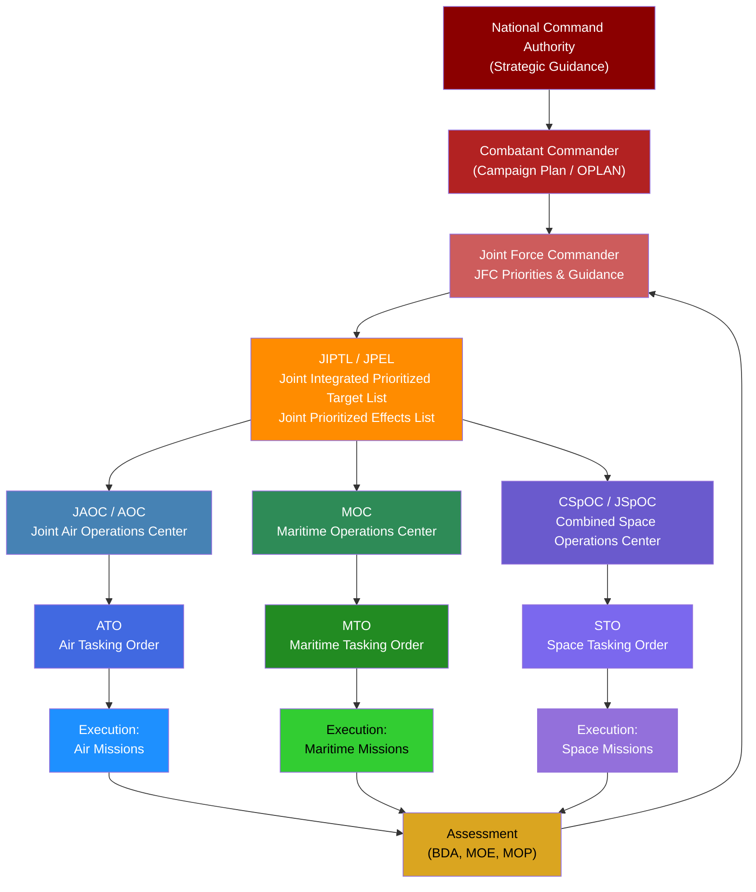
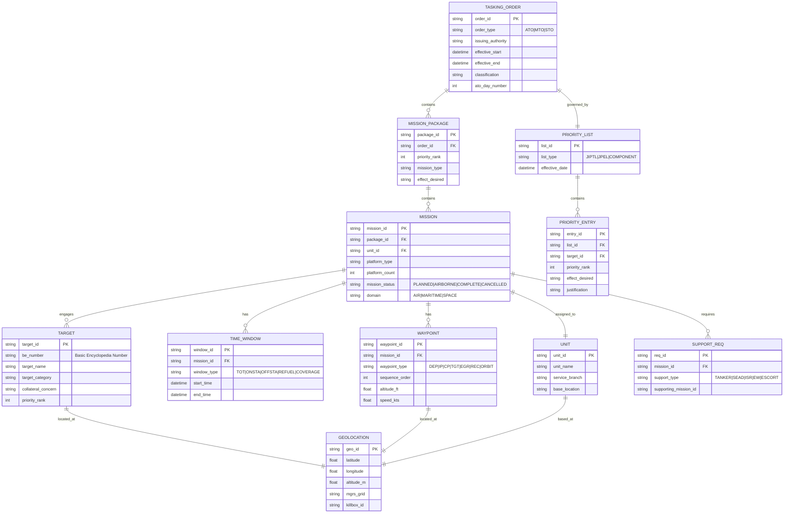
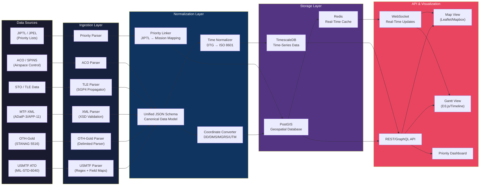
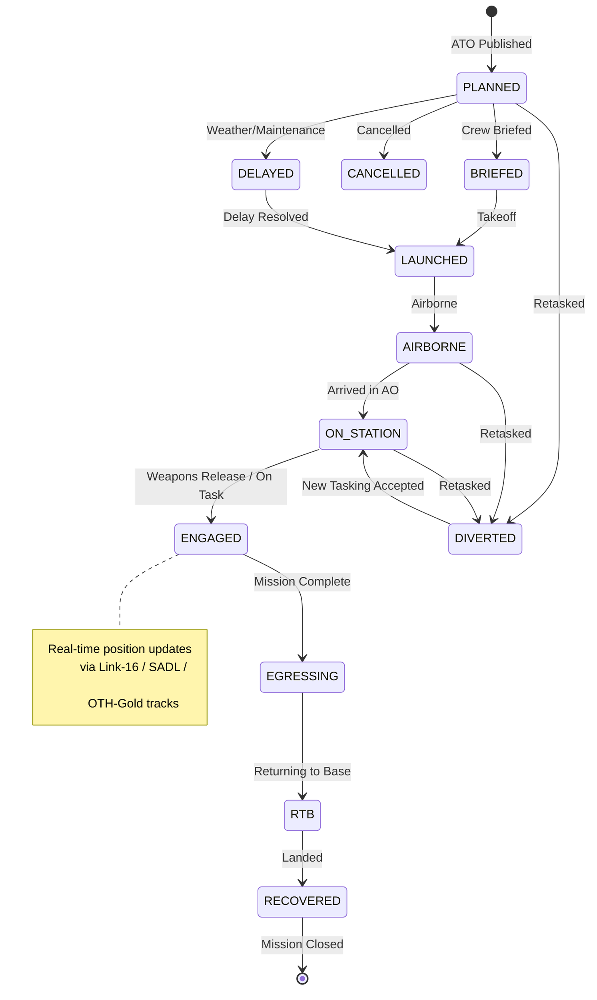

# Deep Dive: Ingesting, Parsing, and Visualizing ATO/MTO/STO Data for Real-Time Decision Support

 

---

 

## Part 1: The Actual Data Standards — What Exists Today

 

### 1.1 USMTF (United States Message Text Format)

 

The **primary machine-readable format** for the ATO has historically been **USMTF** — a fixed-field, character-delimited message format governed by **MIL-STD-6040** (formerly MIL-STD-188-220). The ATO message is formally designated as **USMTF Message Identifier: ATO** [1].

 

**Key characteristics of USMTF ATO messages:**

 

| Field | Description | Example |

|-------|-------------|---------|

| **MSGID** | Message identification set | `MSGID/ATO/COMUSCENTAF//` |

| **AESSION** | ATO session identifier | `AESSION/ATO 025A/011200ZJAN26/012359ZJAN26/` |

| **AMSNDAT** | Air Mission Data (per mission) | `AMSNDAT/PKGA01/CAS/4xF-16C/388FW/` |

| **MSNACFT** | Aircraft type/quantity | `MSNACFT/F-16C/4/` |

| **GTGTLOC** | Target location (lat/long) | `GTGTLOC/33N04500/044E02300/` |

| **ARPTS** | Departure/recovery airfields | `ARPTS/DEP/OAIX//REC/OAIX/` |

| **MSNTIME** | Mission timing | `MSNTIME/TOT/011430ZJAN26/` |

| **CNTRLPT** | Control/coordination points | `CNTRLPT/CP/IP ALPHA/32N55000/043E45000/` |

| **AMSNLOC** | Mission area coordinates | `AMSNLOC/KILLBOX/AG3456/` |

| **PRITEFRT** | Priority and effort allocation | `PRITEFRT/1/CAS/IMMEDIATE/` |

 

**USMTF is delimited by slashes (`/`)** and uses **SET/FIELD/SUBFIELD** hierarchy. Each line is a "set" containing structured data [1][2].

 

### 1.2 OTH-Gold (Over-the-Horizon Gold)

 

**OTH-Gold** is the NATO-standard message format for **track and contact reporting**, heavily used in the **MTO** context. It is governed by **STANAG 5516** and **ADatP-33** [3].

 

**Key OTH-Gold message types relevant to MTO:**

 

| Message Type | Purpose |

|-------------|---------|

| **CONTACT** | Report new contact detection |

| **TRACK** | Report tracked entity with position updates |

| **OWNSHIP** | Report own force position |

| **TASKORD** | Task assignment to units |

| **OPTASK** | Operational tasking (e.g., OPTASK SURFACE, OPTASK ASW) |

 

**OTH-Gold track format example:**

```

TRACK/TRKNUM:AA1234/LAT:33.0750N/LON:044.0389E/

SPD:15.0/CRS:270.0/ALT:0/CLASS:SURFACE/

IDENTITY:HOSTILE/PLATFORM:DDG/TIME:011430ZJAN26/

```

 

### 1.3 MTF-XML and ADatP-3 / APP-11

 

NATO has been transitioning from legacy character-delimited formats to **XML-based message formats** under **ADatP-3 (Allied Data Publication 3)** and its successor **APP-11** [4]. This is the **most important development for machine ingestion**.

 

**MTF-XML ATO Mission Example:**

```xml

<AirTaskingOrder>

  <ATOHeader>

    <ATOIdentifier>ATO-2026-025A</ATOIdentifier>

    <EffectiveDateTime>2026-01-01T12:00:00Z</EffectiveDateTime>

    <ExpirationDateTime>2026-01-01T23:59:00Z</ExpirationDateTime>

    <IssuingAuthority>COMUSCENTAF</IssuingAuthority>

  </ATOHeader>

  <MissionPackage packageID="PKGA01">

    <Priority>1</Priority>

    <MissionType>CAS</MissionType>

    <Mission missionID="MSN4001">

      <AircraftType>F-16C</AircraftType>

      <AircraftCount>4</AircraftCount>

      <Unit>388FW</Unit>

      <DepartureBase ICAO="OAIX"/>

      <RecoveryBase ICAO="OAIX"/>

      <TargetArea>

        <Coordinates>

          <Latitude>33.0750</Latitude>

          <Longitude>44.0389</Longitude>

        </Coordinates>

        <KillboxID>AG3456</KillboxID>

      </TargetArea>

      <Timing>

        <TimeOnTarget>2026-01-01T14:30:00Z</TimeOnTarget>

        <TimeOffTarget>2026-01-01T15:30:00Z</TimeOffTarget>

      </Timing>

      <SupportRequirements>

        <Tanker refuelTrack="AR305" altitude="22000"/>

        <SEAD suppressionWindow="2026-01-01T14:15:00Z/2026-01-01T14:45:00Z"/>

      </SupportRequirements>

    </Mission>

  </MissionPackage>

</AirTaskingOrder>

```

 

### 1.4 Space Tasking Order (STO) Format

 

The STO is a **newer construct** formalized by **USSPACECOM** and governed by emerging doctrine including **Space Doctrine Publication 5-0 (Planning)** and **JP 3-14 (Space Operations)** [5]. The STO format is less mature than the ATO but follows a similar structure:

 

| STO Element | Description |

|-------------|-------------|

| **STO Header** | Issuing authority, effective period, classification |

| **Space Mission Data** | Satellite tasking, orbital parameters, sensor modes |

| **Priority/Effect** | Priority ranking tied to JFC objectives |

| **Coverage Windows** | Time windows for sensor coverage over areas of interest |

| **Orbital Elements** | TLE (Two-Line Element) sets for satellite positions |

| **Coordination** | Deconfliction with other domain operations |

 

**TLE (Two-Line Element) format** — the standard for satellite position data:

```

1 25544U 98067A   26011.50000000  .00016717  00000-0  10270-3 0  9993

2 25544  51.6442 208.9163 0006703  32.0672  89.3241 15.48919755123456

```

 

### 1.5 The Integrated Priority Framework

 

The **Joint Integrated Prioritized Target List (JIPTL)** and **Joint Prioritized Effects List (JPEL)** are the governing priority documents that feed into all three tasking orders. These are governed by **JP 3-60 (Joint Targeting)** [6].

 

**Priority hierarchy as it flows into tasking orders:**

 



 

---

 

## Part 2: Data Schema Design for Ingestion

 

### 2.1 Unified Mission Data Model

 

To ingest ATO, MTO, and STO data into a single system for map and Gantt visualization, you need a **unified data model** that normalizes across all three domains.

 

**Core Entity-Relationship Model:**

 



 

### 2.2 JSON Schema for Unified Ingestion

 

Below is a **JSON Schema** that can serve as the canonical ingestion format for your system:

 

```json

{

  "$schema": http://json-schema.org/draft-07/schema#,

  "title": "UnifiedTaskingOrder",

  "type": "object",

  "required": ["order_id", "order_type", "effective_start", "effective_end", "mission_packages"],

  "properties": {

    "order_id": {

      "type": "string",

      "description": "Unique identifier for the tasking order (e.g., ATO-2026-025A)"

    },

    "order_type": {

      "type": "string",

      "enum": ["ATO", "MTO", "STO"],

      "description": "Domain of the tasking order"

    },

    "issuing_authority": {

      "type": "string",

      "description": "Command issuing the order"

    },

    "effective_start": {

      "type": "string",

      "format": "date-time"

    },

    "effective_end": {

      "type": "string",

      "format": "date-time"

    },

    "classification": {

      "type": "string",

      "enum": ["UNCLASSIFIED", "CUI", "CONFIDENTIAL", "SECRET", "TOP SECRET"]

    },

    "priority_framework": {

      "type": "object",

      "properties": {

        "jfc_priorities": {

          "type": "array",

          "items": {

            "type": "object",

            "properties": {

              "priority_rank": {"type": "integer"},

              "effect": {"type": "string"},

              "description": {"type": "string"},

              "associated_targets": {

                "type": "array",

                "items": {"type": "string"}

              }

            }

          }

        }

      }

    },

    "mission_packages": {

      "type": "array",

      "items": {

        "type": "object",

        "required": ["package_id", "missions"],

        "properties": {

          "package_id": {"type": "string"},

          "priority_rank": {"type": "integer"},

          "mission_type": {"type": "string"},

          "missions": {

            "type": "array",

            "items": {

              "type": "object",

              "required": ["mission_id", "platform_type", "waypoints", "time_windows"],

              "properties": {

                "mission_id": {"type": "string"},

                "domain": {"type": "string", "enum": ["AIR", "MARITIME", "SPACE"]},

                "platform_type": {"type": "string"},

                "platform_count": {"type": "integer"},

                "unit": {"type": "string"},

                "mission_status": {

                  "type": "string",

                  "enum": ["PLANNED", "LAUNCHED", "AIRBORNE", "ON_STATION", "RTB", "COMPLETE", "CANCELLED", "DIVERTED"]

                },

                "waypoints": {

                  "type": "array",

                  "items": {

                    "type": "object",

                    "properties": {

                      "waypoint_type": {"type": "string"},

                      "sequence": {"type": "integer"},

                      "latitude": {"type": "number"},

                      "longitude": {"type": "number"},

                      "altitude_ft": {"type": "number"},

                      "speed_kts": {"type": "number"},

                      "mgrs": {"type": "string"},

                      "killbox": {"type": "string"}

                    }

                  }

                },

                "time_windows": {

                  "type": "array",

                  "items": {

                    "type": "object",

                    "properties": {

                      "window_type": {"type": "string"},

                      "start": {"type": "string", "format": "date-time"},

                      "end": {"type": "string", "format": "date-time"}

                    }

                  }

                },

                "targets": {

                  "type": "array",

                  "items": {

                    "type": "object",

                    "properties": {

                      "target_id": {"type": "string"},

                      "be_number": {"type": "string"},

                      "target_name": {"type": "string"},

                      "latitude": {"type": "number"},

                      "longitude": {"type": "number"},

                      "priority_rank": {"type": "integer"},

                      "desired_effect": {"type": "string"}

                    }

                  }

                },

                "support_requirements": {

                  "type": "array",

                  "items": {

                    "type": "object",

                    "properties": {

                      "support_type": {"type": "string"},

                      "supporting_mission_id": {"type": "string"},

                      "time_window": {

                        "type": "object",

                        "properties": {

                          "start": {"type": "string", "format": "date-time"},

                          "end": {"type": "string", "format": "date-time"}

                        }

                      }

                    }

                  }

                }

              }

            }

          }

        }

      }

    }

  }

}

```

 

---

 

## Part 3: The Ingestion Pipeline Architecture

 

### 3.1 System Architecture

 



 

### 3.2 Parser Specifications

 

#### USMTF ATO Parser Logic

 

The USMTF parser must handle the **SET/FIELD/SUBFIELD** hierarchy. Here is the parsing logic:

 

```python

# USMTF ATO Parser - Pseudocode with detailed field mappings

#

 

Reference: MIL-STD-6040B

 

import re

from datetime import datetime

 

class USMTFParser:

    """

    Parses USMTF ATO messages into the Unified JSON Schema.

   

    USMTF Structure:

    - Each line is a "SET" identified by a keyword (e.g., AMSNDAT, GTGTLOC)

    - Fields within a set are delimited by forward slashes (/)

    - Subfields within a field are positional

    - Empty fields are represented by consecutive slashes (//)

    """

   

    # SET identifiers and their field structures

    SET_DEFINITIONS = {

        'MSGID': ['msg_type', 'originator', 'qualifier'],

        'AESSION': ['ato_id', 'start_dtg', 'end_dtg'],

        'AMSNDAT': ['package_id', 'mission_type', 'aircraft_config', 'unit'],

        'MSNACFT': ['aircraft_type', 'quantity', 'callsign', 'mode2'],

        'GTGTLOC': ['latitude', 'longitude', 'elevation', 'target_id'],

        'MSNTIME': ['time_type', 'dtg'],

        'ARPTS': ['function', 'icao_code', 'name'],

        'CNTRLPT': ['point_type', 'point_name', 'latitude', 'longitude', 'altitude'],

        'AMSNLOC': ['area_type', 'area_id', 'coordinates'],

        'PRITEFRT': ['priority', 'mission_type', 'urgency'],

        'MSNROUTE': ['route_type', 'waypoints'],

        'TANKER': ['track_id', 'altitude', 'frequency', 'onload_type'],

    }

   

    def parse_line(self, line: str) -> dict:

        """Parse a single USMTF set line into structured data."""

        # Remove trailing slash and split by delimiter

        fields = line.strip().rstrip('/').split('/')

        set_id = fields[0]

       

        if set_id in self.SET_DEFINITIONS:

            field_names = self.SET_DEFINITIONS[set_id]

            result = {'set_type': set_id}

            for i, name in enumerate(field_names):

                if i + 1 < len(fields):

                    result[name] = fields[i + 1]

                else:

                    result[name] = None

            return result

        return {'set_type': set_id, 'raw_fields': fields[1:]}

   

    def parse_dtg(self, dtg_string: str) -> datetime:

        """

        Convert USMTF Date-Time Group to ISO 8601.

        Format: DDHHMMZmmmYY (e.g., 011430ZJAN26)

        """

        pattern = r'(\d{2})(\d{2})(\d{2})Z([A-Z]{3})(\d{2})'

        match = re.match(pattern, dtg_string)

        if match:

            day, hour, minute, month_str, year = match.groups()

            months = {'JAN':1,'FEB':2,'MAR':3,'APR':4,'MAY':5,'JUN':6,

                      'JUL':7,'AUG':8,'SEP':9,'OCT':10,'NOV':11,'DEC':12}

            return datetime(2000 + int(year), months[month_str],

                          int(day), int(hour), int(minute))

        return None

   

    def parse_coordinates(self, lat_str: str, lon_str: str) -> tuple:

        """

        Convert USMTF coordinate format to decimal degrees.

        Format: DDNMMSSs / DDDEMMSSs (e.g., 33N04500 / 044E02300)

        """

        # Latitude parsing

        lat_match = re.match(r'(\d{2})([NS])(\d{3})(\d{2})?', lat_str)

        if lat_match:

            deg, hemi, min_sec, sec = lat_match.groups()

            lat = int(deg) + int(min_sec[:2])/60 + (int(min_sec[2:])*10 +

                  (int(sec) if sec else 0))/3600

            if hemi == 'S':

                lat = -lat

       

        # Longitude parsing 

        lon_match = re.match(r'(\d{3})([EW])(\d{3})(\d{2})?', lon_str)

        if lon_match:

            deg, hemi, min_sec, sec = lon_match.groups()

            lon = int(deg) + int(min_sec[:2])/60 + (int(min_sec[2:])*10 +

                  (int(sec) if sec else 0))/3600

            if hemi == 'W':

                lon = -lon

       

        return (lat, lon)

   

    def parse_full_ato(self, message: str) -> dict:

        """Parse a complete ATO message into unified JSON format."""

        lines = message.strip().split('\n')

       

        ato = {

            'order_type': 'ATO',

            'mission_packages': [],

            'current_package': None,

            'current_mission': None

        }

       

        for line in lines:

            parsed = self.parse_line(line)

            set_type = parsed['set_type']

           

            if set_type == 'AESSION':

                ato['order_id'] = parsed.get('ato_id')

                ato['effective_start'] = self.parse_dtg(

                    parsed.get('start_dtg', '')).isoformat() + 'Z'

                ato['effective_end'] = self.parse_dtg(

                    parsed.get('end_dtg', '')).isoformat() + 'Z'

           

            elif set_type == 'AMSNDAT':

                # New mission entry - create mission object

                mission = {

                    'mission_id': parsed.get('package_id'),

                    'mission_type': parsed.get('mission_type'),

                    'domain': 'AIR',

                    'waypoints': [],

                    'time_windows': [],

                    'targets': []

                }

                # Add to current package or create new one

                if not ato['mission_packages']:

                    ato['mission_packages'].append({

                        'package_id': parsed.get('package_id'),

                        'missions': []

                    })

                ato['mission_packages'][-1]['missions'].append(mission)

           

            elif set_type == 'GTGTLOC':

                lat, lon = self.parse_coordinates(

                    parsed.get('latitude', ''),

                    parsed.get('longitude', ''))

                target = {

                    'latitude': lat,

                    'longitude': lon,

                    'target_id': parsed.get('target_id')

                }

                if ato['mission_packages'] and \

                   ato['mission_packages'][-1]['missions']:

                    ato['mission_packages'][-1]['missions'][-1][

                        'targets'].append(target)

           

            elif set_type == 'MSNTIME':

                if ato['mission_packages'] and \

                   ato['mission_packages'][-1]['missions']:

                    tw = {

                        'window_type': parsed.get('time_type'),

                        'start': self.parse_dtg(

                            parsed.get('dtg', '')).isoformat() + 'Z'

                    }

                    ato['mission_packages'][-1]['missions'][-1][

                        'time_windows'].append(tw)

           

            elif set_type == 'PRITEFRT':

                if ato['mission_packages']:

                    ato['mission_packages'][-1]['priority_rank'] = int(

                        parsed.get('priority', 0))

       

        # Clean up temporary fields

        for key in ['current_package', 'current_mission']:

            ato.pop(key, None)

       

        return ato

```

 

### 3.3 Coordinate Conversion Module

 

A critical component is converting between the many coordinate systems used across ATO/MTO/STO:

 

| Source Format | Example | Used In |

|--------------|---------|---------|

| **DMS (Degrees/Minutes/Seconds)** | 33°04'30"N 044°02'18"E | USMTF ATO |

| **Decimal Degrees** | 33.0750, 44.0383 | JSON/GeoJSON |

| **MGRS (Military Grid Reference)** | 38SMB4356078900 | Ground coordination |

| **UTM** | Zone 38S, 443560E, 3658900N | Mapping |

| **Killbox (GARS-based)** | AG3456 | Airspace/fire support |

| **TLE (Orbital Elements)** | Two-line element set | Space operations |

| **Georef** | NKPB2345 | Legacy naval |

 

---

 

## Part 4: Visualization Architecture

 

### 4.1 Map View — GeoJSON Output

 

All mission data must be converted to **GeoJSON** for map rendering. Here is the output structure:

 

```json

{

  "type": "FeatureCollection",

  "features": [

    {

      "type": "Feature",

      "geometry": {

        "type": "LineString",

        "coordinates": [

          [44.0383, 33.0750],

          [44.2500, 33.1200],

          [44.5000, 33.2500],

          [44.0383, 33.0750]

        ]

      },

      "properties": {

        "mission_id": "MSN4001",

        "domain": "AIR",

        "mission_type": "CAS",

        "platform": "F-16C",

        "priority_rank": 1,

        "status": "PLANNED",

        "callsign": "VIPER 11",

        "package_id": "PKGA01",

        "tot": "2026-01-01T14:30:00Z",

        "waypoint_types": ["DEP", "IP", "TGT", "REC"],

        "color": "#FF0000",

        "icon": "fighter",

        "priority_color": "#FF0000"

      }

    },

    {

      "type": "Feature",

      "geometry": {

        "type": "Point",

        "coordinates": [44.0389, 33.0750]

      },

      "properties": {

        "feature_type": "TARGET",

        "target_id": "TGT-0042",

        "be_number": "1234-56789",

        "target_name": "Bridge Alpha",

        "priority_rank": 1,

        "desired_effect": "DESTROY",

        "jiptl_entry": true,

        "icon": "target",

        "color": "#FF0000"

      }

    },

    {

      "type": "Feature",

      "geometry": {

        "type": "Polygon",

        "coordinates": [[

          [44.0, 33.0], [44.5, 33.0],

          [44.5, 33.5], [44.0, 33.5],

          [44.0, 33.0]

        ]]

      },

      "properties": {

        "feature_type": "KILLBOX",

        "killbox_id": "AG3456",

        "status": "OPEN",

        "controlling_authority": "ASOC"

      }

    }

  ]

}

```

 

### 4.2 Gantt View — Timeline Data Structure

 

For the Gantt chart, missions are rendered as time-bound bars with dependency links:

 

```json

{

  "gantt_data": {

    "ato_period": {

      "start": "2026-01-01T12:00:00Z",

      "end": "2026-01-01T23:59:00Z"

    },

    "priority_groups": [

      {

        "priority_rank": 1,

        "effect": "Neutralize enemy IADS",

        "color": "#FF0000",

        "tasks": [

          {

            "task_id": "MSN4001",

            "label": "VIPER 11 - CAS (F-16C x4)",

            "domain": "AIR",

            "start": "2026-01-01T13:00:00Z",

            "end": "2026-01-01T16:30:00Z",

            "milestones": [

              {"type": "TAKEOFF", "time": "2026-01-01T13:00:00Z"},

              {"type": "REFUEL", "time": "2026-01-01T13:45:00Z"},

              {"type": "IP", "time": "2026-01-01T14:15:00Z"},

              {"type": "TOT", "time": "2026-01-01T14:30:00Z"},

              {"type": "EGRESS", "time": "2026-01-01T15:30:00Z"},

              {"type": "LAND", "time": "2026-01-01T16:30:00Z"}

            ],

            "dependencies": [

              {"type": "REQUIRES", "mission_id": "MSN4010", "label": "SEAD"},

              {"type": "REQUIRES", "mission_id": "MSN4020", "label": "TANKER"}

            ],

            "status": "PLANNED"

          },

          {

            "task_id": "MSN4010",

            "label": "WEASEL 21 - SEAD (F-16CM x2)",

            "domain": "AIR",

            "start": "2026-01-01T13:30:00Z",

            "end": "2026-01-01T15:00:00Z",

            "milestones": [

              {"type": "TAKEOFF", "time": "2026-01-01T13:30:00Z"},

              {"type": "SUPPRESS_START", "time": "2026-01-01T14:15:00Z"},

              {"type": "SUPPRESS_END", "time": "2026-01-01T14:45:00Z"},

              {"type": "LAND", "time": "2026-01-01T15:00:00Z"}

            ],

            "status": "PLANNED"

          }

        ]

      },

      {

        "priority_rank": 2,

        "effect": "Maritime domain awareness",

        "color": "#0066FF",

        "tasks": [

          {

            "task_id": "MSN5001",

            "label": "USS MASON - ASW Patrol",

            "domain": "MARITIME",

            "start": "2026-01-01T12:00:00Z",

            "end": "2026-01-01T23:59:00Z",

            "milestones": [

              {"type": "ON_STATION", "time": "2026-01-01T12:00:00Z"},

              {"type": "SECTOR_CHANGE", "time": "2026-01-01T18:00:00Z"}

            ],

            "patrol_area": {

              "type": "Polygon",

              "coordinates": [[

                [44.0, 25.0], [46.0, 25.0],

                [46.0, 27.0], [44.0, 27.0],

                [44.0, 25.0]

              ]]

            },

            "status": "ON_STATION"

          }

        ]

      },

      {

        "priority_rank": 3,

        "effect": "Persistent ISR coverage",

        "color": "#9933FF",

        "tasks": [

          {

            "task_id": "MSN6001",

            "label": "SAT-042 - EO/IR Pass",

            "domain": "SPACE",

            "start": "2026-01-01T14:22:00Z",

            "end": "2026-01-01T14:34:00Z",

            "milestones": [

              {"type": "AOS", "time": "2026-01-01T14:22:00Z"},

              {"type": "MAX_ELEV", "time": "2026-01-01T14:28:00Z"},

              {"type": "LOS", "time": "2026-01-01T14:34:00Z"}

            ],

            "orbital_params": {

              "tle_line1": "1 25544U 98067A   26011.50 ...",

              "tle_line2": "2 25544  51.6442 208.9163 ..."

            },

            "coverage_area": {

              "center_lat": 33.0750,

              "center_lon": 44.0389,

              "swath_width_km": 120

            },

            "status": "PLANNED"

          }

        ]

      }

    ]

  }

}

```

 

### 4.3 Priority-Driven Color Coding and Symbology

 

| Priority Level | Color | Map Symbol | Gantt Bar Style |

|---------------|-------|------------|-----------------|

| **Priority 1 (Critical)** | $$ \color{red}{\text{Red \#FF0000}} $$ | Solid, large icon | Solid bar, bold label |

| **Priority 2 (High)** | $$ \color{orange}{\text{Orange \#FF8C00}} $$ | Solid, medium icon | Solid bar |

| **Priority 3 (Medium)** | $$ \color{gold}{\text{Yellow \#FFD700}} $$ | Outlined, medium icon | Dashed bar |

| **Priority 4 (Routine)** | $$ \color{green}{\text{Green \#00CC00}} $$ | Outlined, small icon | Thin bar |

| **Priority 5 (Low)** | $$ \color{gray}{\text{Gray \#999999}} $$ | Dotted, small icon | Dotted bar |

 

**Domain-specific symbology (MIL-STD-2525D compliant):**

 

| Domain | Symbol Frame | Example |

|--------|-------------|---------|

| **AIR** | Arc (semicircle top) | Fighter, bomber, tanker, ISR |

| **MARITIME** | Full circle | Surface combatant, submarine, patrol |

| **SPACE** | Inverted trapezoid | Satellite, ground station |

| **LAND** | Rectangle | Ground unit, FARP, airfield |

 

---

 

## Part 5: Real-Time Execution Tracking

 

### 5.1 Status State Machine

 

Missions transition through states that must be tracked in real-time:

 



 

### 5.2 Real-Time Data Feeds

 

For real-time execution tracking, the system must ingest **position updates** from tactical data links:

 

| Data Link | Format | Update Rate | Content |

|-----------|--------|-------------|---------|

| **Link-16 (TADIL-J)** | J-Series Messages (J3.2, J3.5) | 3-12 sec | Air tracks, position, IFF |

| **SADL** | Situational Awareness Data Link | 12 sec | Ground/CAS coordination |

| **VMF (Variable Message Format)** | MIL-STD-6017 | Variable | Ground force positions |

| **AIS** | NMEA 0183 / ITU-R M.1371 | 2-180 sec | Maritime surface tracks |

| **ADS-B** | 1090ES / UAT | 1 sec | Aircraft position/velocity |

| **Space Track** | TLE / SP Ephemeris | Periodic | Satellite orbital elements |

 

### 5.3 WebSocket Real-Time Update Schema

 

```json

{

  "event_type": "POSITION_UPDATE",

  "timestamp": "2026-01-01T14:32:15Z",

  "mission_id": "MSN4001",

  "callsign": "VIPER 11",

  "domain": "AIR",

  "position": {

    "latitude": 33.1250,

    "longitude": 44.3200,

    "altitude_ft": 18500,

    "heading": 275,

    "speed_kts": 420

  },

  "status": "AIRBORNE",

  "fuel_state": "6.2",

  "weapons_status": {

    "expended": ["GBU-38 x1"],

    "remaining": ["GBU-38 x3", "AIM-9X x2", "AIM-120C x2"]

  },

  "next_waypoint": {

    "type": "TGT",

    "eta": "2026-01-01T14:38:00Z"

  }

}

```

 

---

 

## Part 6: Implementation Roadmap

 

### 6.1 Phased Development Plan

 

```mermaid

gantt

    title ATO/MTO/STO Visualization System Development

    dateFormat  YYYY-MM-DD

    axisFormat  %b %Y

 

    section Phase 1 - Foundation

    Data Model & Schema Design           :done, p1a, 2026-02-15, 30d

    USMTF Parser Development             :p1b, after p1a, 45d

    XML/MTF-XML Parser                   :p1c, after p1a, 45d

    Coordinate Conversion Library        :p1d, after p1a, 30d

    PostGIS Database Setup               :p1e, after p1a, 20d

 

    section Phase 2 - Core Visualization

    GeoJSON Generation Engine            :p2a, after p1b, 30d

    Map View (Leaflet/Mapbox)            :p2b, after p2a, 45d

    Gantt View (D3.js)                   :p2c, after p2a, 45d

    Priority Dashboard                   :p2d, after p2a, 30d

    MIL-STD-2525D Symbology              :p2e, after p2b, 30d

 

    section Phase 3 - Real-Time

    WebSocket Infrastructure             :p3a, after p2b, 30d

    Link-16 / Track Ingestion            :p3b, after p3a, 45d

    Real-Time Map Updates                :p3c, after p3b, 30d

    Status State Machine                 :p3d, after p3a, 30d

 

    section Phase 4 - Multi-Domain

    OTH-Gold / MTO Parser                :p4a, after p2c, 30d

    TLE / STO Parser                     :p4b, after p2c, 30d

    Maritime Track Overlay               :p4c, after p4a, 30d

    Satellite Pass Visualization         :p4d, after p4b, 30d

 

    section Phase 5 - AI Integration

    Natural Language Query Interface      :p5a, after p3c, 45d

    Anomaly Detection                    :p5b, after p3c, 45d

    Predictive Scheduling                :p5c, after p5a, 45d

    Decision Support Recommendations     :p5d, after p5b, 45d

```

 

### 6.2 Technology Stack Recommendation

 

| Layer | Technology | Justification |

|-------|-----------|---------------|

| **Parsing** | Python (regex, lxml, sgp4) | Best library ecosystem for military formats |

| **Database** | PostgreSQL + PostGIS + TimescaleDB | Geospatial + time-series in one DB |

| **Cache** | Redis | Sub-millisecond real-time state |

| **API** | FastAPI (Python) or Node.js | High-performance async API |

| **Real-Time** | WebSockets (Socket.IO) | Bidirectional real-time updates |

| **Map** | Mapbox GL JS or Leaflet + MIL-STD-2525D renderer | Military symbology support |

| **Gantt** | D3.js or vis-timeline | Flexible, customizable timeline |

| **AI/ML** | Ask Sage API + local models | NLP query, anomaly detection |

| **Symbology** | milsymbol.js | MIL-STD-2525D symbol rendering |

| **Orbital** | sgp4 (Python) / satellite.js | TLE propagation for space tracks |

 

---

 

## Part 7: Governing Documents Reference

 

| Document | Scope | Key Content |

|----------|-------|-------------|

| **JP 3-30** (Joint Air Operations) | ATO Cycle | Full ATO cycle, JAOC operations, air apportionment [2] |

| **JP 3-32** (Joint Maritime Operations) | MTO Cycle | Maritime operations center, MTO production [3] |

| **JP 3-14** (Space Operations) | STO Cycle | Space tasking, orbital operations [5] |

| **JP 3-60** (Joint Targeting) | Targeting/Priorities | JIPTL, JPEL, targeting cycle [6] |

| **MIL-STD-6040B** | USMTF Format | Message format standard for ATO [1] |

| **STANAG 5516** | OTH-Gold | NATO track reporting standard [3] |

| **ADatP-3 / APP-11** | MTF-XML | NATO XML message formats [4] |

| **MIL-STD-2525D** | Symbology | Military map symbol standard |

| **CJCSI 3505.01** | Target Nomination | Joint target nomination procedures |

| **CJCSI 3122.06** | JOPES | Joint operation planning formats |

| **Space Doctrine Pub 5-0** | Space Planning | USSF planning doctrine [5] |

| **AFDP 3-0** (Operations & Planning) | Air Operations | USAF operational doctrine |

| **NWP 3-56** (Composite Warfare Commander) | Maritime C2 | Navy warfare commander doctrine |

 

---

 

## Part 8: Key Considerations and Risks

 

### 8.1 Classification Challenges

- ATO/MTO/STO data is typically classified **SECRET** or higher

- System must operate on appropriate networks (SIPRNet/JWICS)

- Data sanitization required for any cross-domain transfer

- Consider using **CUI-marked** training data for development on lower networks

 

### 8.2 Data Quality Risks

 

| Risk | Mitigation |

|------|-----------|

| Inconsistent coordinate formats across sources | Robust multi-format parser with validation |

| Missing or incomplete mission data | Default value handling + operator alerts |

| Time synchronization across domains | All times normalized to UTC/Zulu |

| Conflicting priority assignments | Priority conflict resolution rules tied to JFC guidance |

| Legacy format variations | Version-aware parsers with fallback logic |

 

### 8.3 Operational Recommendations

 

1. **Start with ATO parsing** — it is the most mature and well-documented format

2. **Build the unified data model first** — this is the foundation everything else depends on

3. **Use GeoJSON as the canonical geospatial format** — universal support across mapping libraries

4. **Implement priority as a first-class data element** — not an afterthought; it should drive visualization hierarchy, color coding, and filtering

5. **Plan for real-time from the start** — even if initial implementation is batch-based, architect for WebSocket updates

6. **Validate against real ATO extracts** — work with AOC personnel to obtain sanitized ATO examples for parser testing

 

---

 

This architecture gives you a complete pipeline from raw military tasking order formats through to interactive map and Gantt visualizations, with priorities baked into every layer of the data model. The key insight is that **the priority hierarchy (NCA → CCDR → JFC → JIPTL → Component Tasking Order → Individual Mission)** must be preserved as a traceable chain through the entire data pipeline, so that a decision-maker looking at the map or Gantt chart can immediately understand *why* a mission exists and *how important it is* relative to everything else happening in the battlespace.